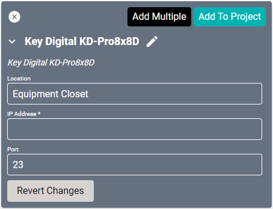
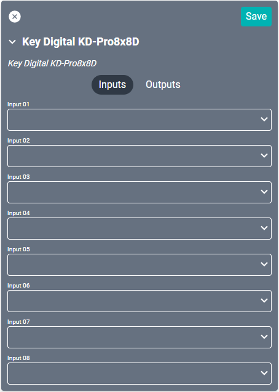
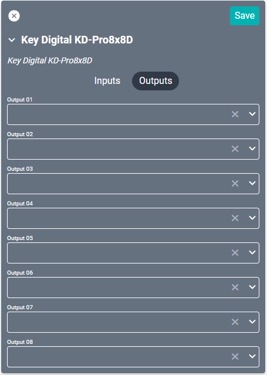

# Key Digital KD-Pro8x8D Driver
This driver interfaces with [this](https://keydigital.org/category/discontinued/KD-Pro8x8D) HDBaseT/HDMI matrix switcher.

#### Properties

* **Name:** Name of the device.

* **Location:** Location of the device within the Project. New Locations can be created by selecting this field, typing in a new name, and then selecting the corresponding "Add New Tag" option or pressing Enter on your keyboard.

* **IP Address:** The destination IP address that SAVI will use when communicating with the device.

* **Port:** The IP address port that the device is open to. Set to 23 by default.

#### Connections

##### Input

* **Input (01-08):** Up to eight HDMI inputs.

##### Output

* **Output (01-08):** Up to eight outputs through HDMI, audio euroblock, PCM digital audio, and HDBaseT. Only use one type of connection per output number.
