

<a href="../../../Assets/Knowledge-Base/Creator/Drivers/Logos/klark-teknik-logo.jpg">
  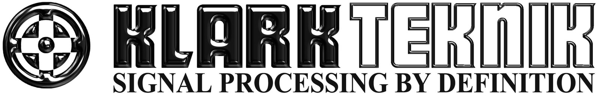
</a>

# Klark Teknik DM8500 DSP Drivers
These drivers support the [Klark Teknik DM8500](https://klarkteknik.com/product.html?modelCode=P0E4D "Klark Teknik DM8500") audio matrix switch. These drivers are saparated by function. Typically a volume control driver and a source selection driver are used in tandem, but are not necessarily required.

## Volume Control

### Level Control Driver
The level driver controls minimum and maximum volume range as well as how the volume scale is displayed.

#### Properties
<a href="../../../Assets/Knowledge-Base/Creator/Drivers/klark-teknik-dm8500-dsp-level-control-01.png">
  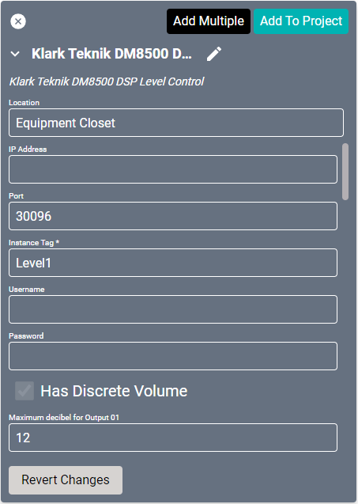
</a>
<a href="../../../Assets/Knowledge-Base/Creator/Drivers/klark-teknik-dm8500-dsp-level-control-02.png">
  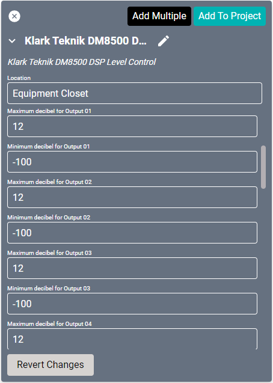
</a>

* **Name:** Name of the device.

* **Location:** Location of the device within the Project. New Locations can be created by selecting this field, typing in a new name, and then selecting the corresponding "Add New Tag" option or pressing Enter on your keyboard.

* **IP Address:** The destination IP address that SAVI will use when communicating with the device.

* **Port:** The IP address port that the device is open to. Set to 30096 by default.

* **Instance Tag:** The Device ID/Instance ID of the processing block.

* **Username:** Login username of the device.

* **Password:** Login password of the device.

* **Has Discrete Volume:** If enabled, this audio zone has discrete audio capability.

* **Maximum decibel for Output (01-16):** Maximum decibels allowed. Set to 12 by default.

* **Minimum decibel for Output (01-16):** Minimum decibels allowed. Set to -100 by default.

### Connections

##### Output
<a href="../../../Assets/Knowledge-Base/Creator/Drivers/klark-teknik-dm8500-dsp-level-control-connections-output.png">
  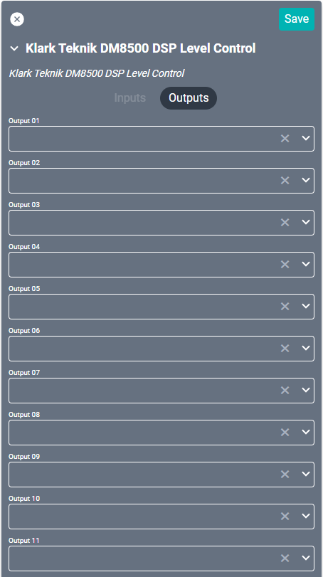
</a>

* **Output (01-16):** Supports up to sixteen audio outputs.

### Output Driver

#### Properties
<a href="../../../Assets/Knowledge-Base/Creator/Drivers/klark-teknik-dm8500-dsp-output.png">
  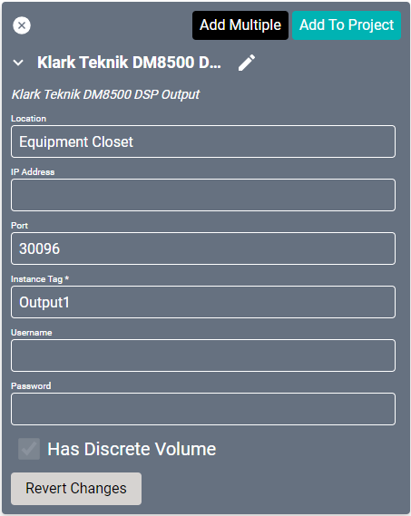
</a>

* **Name:** Name of the device.

* **Location:** Location of the device within the Project. New Locations can be created by selecting this field, typing in a new name, and then selecting the corresponding "Add New Tag" option or pressing Enter on your keyboard.

* **IP Address:** The destination IP address that SAVI will use when communicating with the device.

* **Port:** The IP address port that the device is open to. Set to 30096 by default.

* **Instance Tag:** The Device ID/Instance ID of the processing block.

* **Username:** Login username of the device.

* **Password:** Login password of the device.

* **Has Discrete Volume:** If enabled, this audio zone has discrete audio capability.

### Connections

##### Output
<a href="../../../Assets/Knowledge-Base/Creator/Drivers/klark-teknik-dm8500-dsp-output-connections-output.png">
  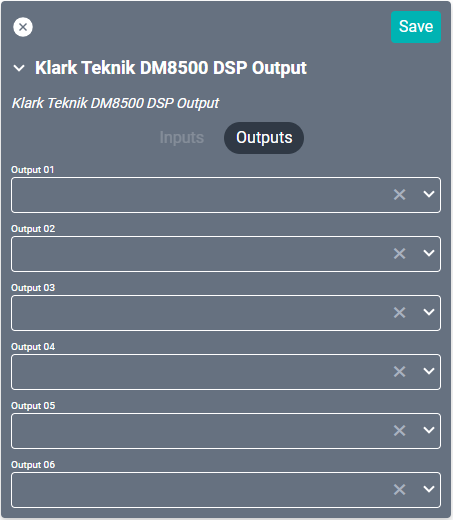
</a>

* **Output (01-06):** Supports up to six audio outputs.

----

## Source Selection
The Matrix or Standard Mixer, Source Selection, and Router drivers each complete roughly the same function. The driver you use is determined by the biamp UI configuration.

### Matrix or Standard Mixer Driver
This drivers works as both a source selection and a volume controller and should not require one of the above Volume control drivers.

#### Properties
<a href="../../../Assets/Knowledge-Base/Creator/Drivers/klark-teknik-dm8500-dsp-matrix-or-standard-mixer.png">
  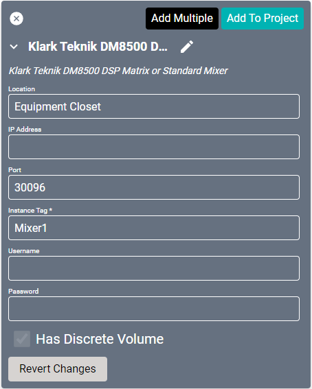
</a>

* **Name:** Name of the device.

* **Location:** Location of the device within the Project. New Locations can be created by selecting this field, typing in a new name, and then selecting the corresponding "Add New Tag" option or pressing Enter on your keyboard.

* **IP Address:** The destination IP address that SAVI will use when communicating with the device.

* **Port:** The IP address port that the device is open to. Set to 30096 by default.

* **Instance Tag:** The Device ID/Instance ID of the processing block.

* **Username:** Login username of the device.

* **Password:** Login password of the device.

* **Has Discrete Volume:** If enabled, this audio zone has discrete audio capability.

### Connections

##### Input
<a href="../../../Assets/Knowledge-Base/Creator/Drivers/klark-teknik-dm8500-dsp-matrix-or-standard-mixer-connections-input.png">
  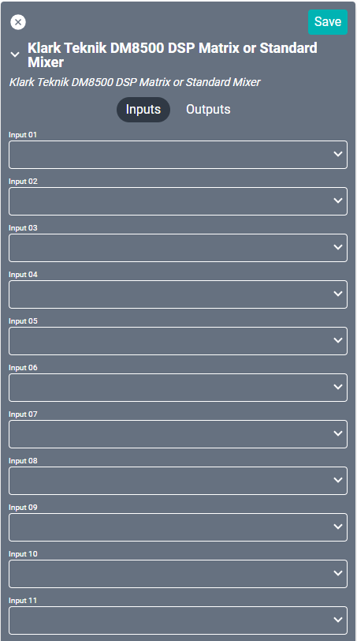
</a>

* **Input (01-16):** Supports up to sixteen audio inputs. 

##### Output
<a href="../../../Assets/Knowledge-Base/Creator/Drivers/klark-teknik-dm8500-dsp-matrix-or-standard-mixer-connections-output.png">
  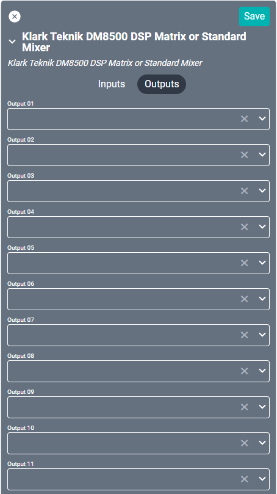
</a>

* **Output (01-16):** Supports up to sixteen audio outputs. 

### Source Selection Driver

#### Properties
<a href="../../../Assets/Knowledge-Base/Creator/Drivers/klark-teknik-dm8500-dsp-source-selection.png">
  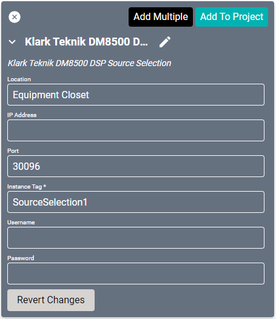
</a>

* **Name:** Name of the device.

* **Location:** Location of the device within the Project. New Locations can be created by selecting this field, typing in a new name, and then selecting the corresponding "Add New Tag" option or pressing Enter on your keyboard.

* **IP Address:** The destination IP address that SAVI will use when communicating with the device.

* **Port:** The IP address port that the device is open to. Set to 30096 by default.

* **Instance Tag:** The Device ID/Instance ID of the processing block.

* **Username:** Login username of the device.

* **Password:** Login password of the device.

### Connections

##### Input
<a href="../../../Assets/Knowledge-Base/Creator/Drivers/klark-teknik-dm8500-dsp-source-selection-connections-input.png">
  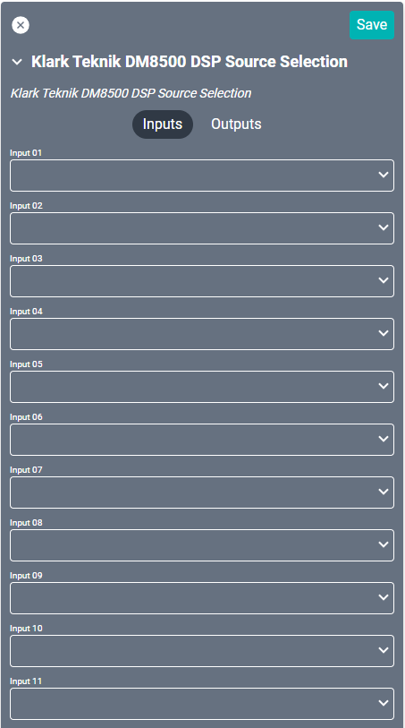
</a>

* **Input (01-16):** Supports up to sixteen audio inputs.

##### Output
<a href="../../../Assets/Knowledge-Base/Creator/Drivers/klark-teknik-dm8500-dsp-source-selection-connections-output.png">
  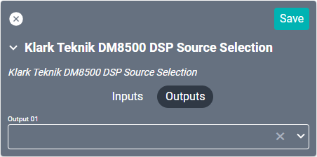
</a>

* **Output 01:** Connection to the device Matrix/Standard Mixer or Router driver.

### Router Driver

#### Properties
<a href="../../../Assets/Knowledge-Base/Creator/Drivers/klark-teknik-dm8500-dsp-router.png">
  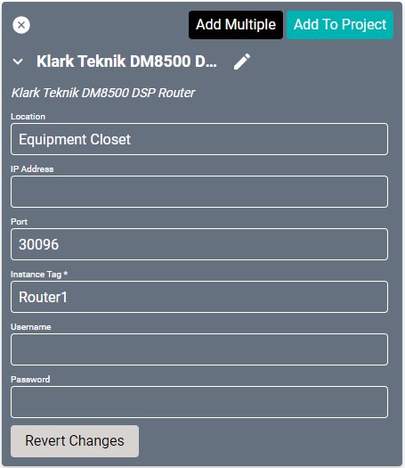
</a>

* **Name:** Name of the device.

* **Location:** Location of the device within the Project. New Locations can be created by selecting this field, typing in a new name, and then selecting the corresponding "Add New Tag" option or pressing Enter on your keyboard.

* **IP Address:** The destination IP address that SAVI will use when communicating with the device.

* **Port:** The IP address port that the device is open to. Set to 30096 by default.

* **Instance Tag:** The Device ID/Instance ID of the processing block.

* **Username:** Login username of the device.

* **Password:** Login password of the device.

### Connections

##### Input
<a href="../../../Assets/Knowledge-Base/Creator/Drivers/klark-teknik-dm8500-dsp-router-connections-input.png">
  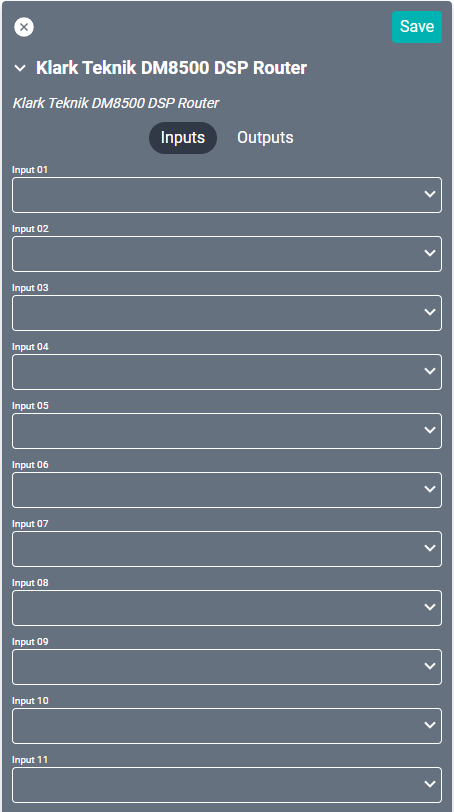
</a>

* **Input (01-16):** Supports up to sixteen audio inputs. `Should connect to another driver?`

##### Output
<a href="../../../Assets/Knowledge-Base/Creator/Drivers/klark-teknik-dm8500-dsp-router-connections-output.png">
  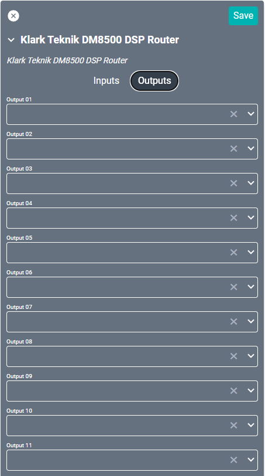
</a>

* **Output (01-16):** Supports up to sixteen audio outputs. `Should connect to another driver?`
