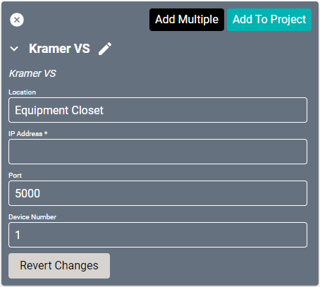
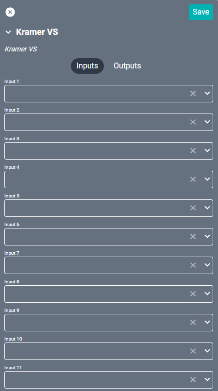
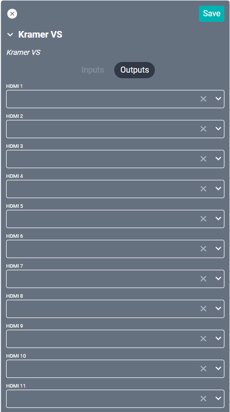

# Kramer VS Drivers
This driver supports the [Kramer VS series](https://www.kramerav.com/products/switchers_routers "Kramer VS series") video matrix switches through IP.

#### Properties

* **Name:** Name of the device.

* **Location:** Location of the device within the Project. New Locations can be created by selecting this field, typing in a new name, and then selecting the corresponding "Add New Tag" option or pressing Enter on your keyboard.

* **IP Address:** The destination IP address that SAVI will use when communicating with the device.

* **Port:** The IP address port that the device is open to. Set to 5000 by default.

* **Device Number:** Determines the position of the unit in a chain of up to 15. Set to 1 by default.

#### Connections

##### Input

* **Input (1-64):** Supports up to sixty-four video inputs (still restricted by physical hardware).

##### Output

* **Output (1-64):** Supports up to sixty-four video outputs (still restricted by physical hardware).
