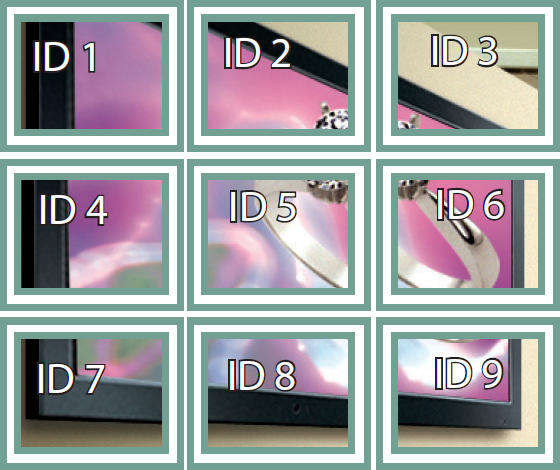

# LG Canvas Decoder (WP400) Drivers

The LG Canvas Decoder driver interfaces with the [WP400](https://www.lg.com/global/business/digital-signage/lg-WP400), [WP401](https://www.lg.com/global/business/digital-signage/lg-WP401), and [WP402](https://www.lg.com/global/business/digital-signage/lg-WP402) units. These units allow retrofitting SAVI Canvas into legacy environments leveraging displays and projectors using only HDMI connections. Connect the Decoder to any display and have the full functionality of a LG WebOS display with Canvas support. This driver also supports RS232 control of the connected device you are using.

>***Note: This does not support serial control for devices that require multi-byte commands. This means WP400s are not compatible with serial DBX drivers. In that situation, we suggest using the [SAVI Connect I/O](/Knowledge-Base/Creator/Drivers/SAVI/connect-io-drivers.md).***

#### General Properties

* **Name:** Name of the device.

* **Location:** Location of the device within the Project. New Locations can be created by selecting this field, typing in a new name, and then selecting the corresponding "Add New Tag" option or pressing Enter on your keyboard.

* **Hidden Sources:** Sources that are not shown when viewing the source select in Facility View for this display.

* **Default Layout:** Canvas layout that is auto selected when playing a source.

* **Available Layouts:** Canvas layouts available to be viewed on the display and selectable from the layout selector in Facility View. This can be edited here or in the Layout Editor.

* **Power Off After 15 Min of 'No Signal':** If True, this display will automatically power down after 15 mins of not getting a signal. This is unchecked by default as enabling it is not recommended with SAVI.

* **Power On Status:** When this display (re)connects to SAVI, its power on status is changed to this value.

* **Rotation:** The orientation of the display. 0 is default, with the display mounted horizontal. 90 and 270 are used when the display is mounted vertically (rotated either right or left). 180 is used when mounting the display horizontally upside-down (not recommended as most mounts are not designed for this).

* **Startup Audio Mode:** When this display (re)connects to SAVI, its audio mode is changed to this value.

* **Startup Volume:** When this display (re)connects to SAVI, its volume level is changed to this value.

* **Startup Picture Mode:** When this display (re)connects to SAVI, its picture mode is changed to this value

* **Startup Power Management Mode:** When this display (re)connects to SAVI, its power management mode is changed to this value.

* **USB Lock:** Enabling this will disable file reading from the USB port on the display but will still allow input from peripheral devices, like keyboards and mice.

* **IR Mode:** Setting this to Normal allows IR input as usual, Use Power Only will only allow IR input to power the display on/off, and Block All prevents all IR input at the display (however this will still allow IR control if IR Remote Map is enabled).

* **Button Mode:** Like IR Mode, setting this to Normal allows button presses on the display as per usual, Use Power Only will only allow button input to power the display on/off, and Block All disables all buttons on the display.

* **Streaming Latency:** The delay (in ms) injected into the streaming pipeline to keep playback smooth. Range of 400 to 10000. Use -1 to keep the manufacturer's default. Default value is 700.
  >***Note: Streaming Latency values below 400 are not recommended.***

#### Advanced Properties

* **Tile Mode (SM5KE, UL3G, \& webOS Only):** Determines how tile mode is treated by SAVI.
    * **Do Not Change:** This setting will leave Tile Mode settings alone and allow switching between modes.
    * **Yes:** This setting will enable Tile Mode.
    * **No:** This setting will disable Tile Mode completely.

* **Tile Mode Row:** Sets the number of rows in the tile configuration. Set to 1 by default. Range is 1-15.

* **Tile Mode Column:** Sets the number of columns in the tile configuration. Set to 1 by default. Range is 1-15.

* **Tile Mode Tile Id:** Sets which display this is in the grid (starts at 1 in the top left, increasing by 1 from left to right and continuing on the left of the next row under). Set to 1 by default. Range is 1-255.

* **Tile Mode Natural Mode:** Enabling this will partly omit the edges of the image displayed to compensate for distance between displays.

* **IR Remote Map: Video:** The way in which IR remotes control video in SAVI. Disabled prevents remote control, Gestures allows control of layouts and sources with a standard LG remote (Left and Right arrows toggle through sources, Up and Down arrows toggle through layouts), Control Source allows control of the connected source (if that source is controllable).

* **IR Remote Map: Audio:** The way in which IR remotes control audio in SAVI. Disabled prevents remote control. Allows the LG remote's volume buttons to control the display's volume (if "Control Display" is selected) or a SAVI Audio Zone (if "Control Audio Zone" is selected)

* **Audio Zone for IR Remote Map:** The audio zone to control when IR Remote Map: Audio is set to 'Control Audio Zone.'

* **Display Specific Region (1-4) Type:** Set the type of input so Creator knows whether to look at the URL field or Line In Input field.

* **Display Specific Region (1-4) URL:** For any type of URL (Video, Image, VNC). Ignored when Region Type is Line In.

* **Display Specific Region (1-4) Line In Input:** Ignored when Region Type is not Line In.

* **Startup TruMotion:** Used to convert lower framerates up to 60 fps.
    * **Do Not Change:** Will use SAVI defaults (recommended).
    * **Disable:** Will disable framerate adjustments and match source framerate.

* **Startup Real Cinema:** Used to convert lower refresh rates up to 120 Hz.
    * **Do Not Change:** Will use SAVI defaults (recommended).
    * **Enable:** Will convert lower refresh rates up to 120 Hz.
    * **Disable:** Will disable refresh rate adjustments and match source refresh rate.

### Connections
The connections for the WP400 are for devices physically attached with appropriate cabling. As such, it's best to install all connected devices in the same rack or in close proximity to each other.

##### Input

* **HDMI (1 \& 2):** HDMI connection for High Definition video and audio input.

* **DP:** Display Port for High Definition video and audio input.

* **IR:** InfraRED sensor port for remote control input.

##### Output

* **RS232 In:** A 3.5mm serial configured port which can be used to control an external serial devices (such as a custom RS232 display driver).
  >***Note: The physical port is labeled RS232 In and will connect to the device. Do not use the RS232 Out.***

* **HDMI:** This is where you'd make your connection to the physical display driver, projector, or whatever device you're using to display the WP400's content (such as a custom RS232 display driver).
