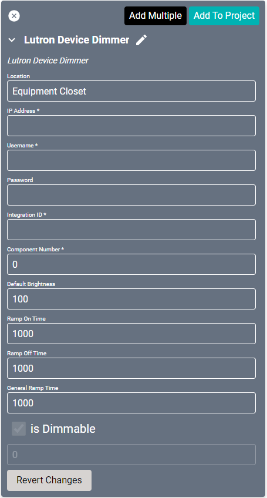
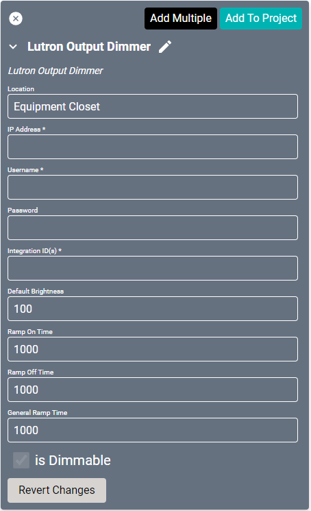

# Lutron Drivers

Lighting drivers do not normally have connection settings. Once these are configured and added to the project, they are ready to go.

## Lutron Device Dimmer
This driver allows the user to activate programming via button presses, releases, etc., as well as monitor those same events as they occur in the system.

#### Properties

* **Name:** Name of the device.

* **Location:** Location of the device within the Project. New Locations can be created by selecting this field, typing in a new name, and then selecting the corresponding "Add New Tag" option or pressing Enter on your keyboard.

* **IP Address:** The destination IP address that SAVI will use when communicating with the device.

* **Username:** Login username of the device.

* **Password:** Login password of the device.

* **Integration ID:** Integration ID provided by Lutron in the integration report.

* **Component Number:** Component number provided by Lutron in the integration report.

* **Default Brightness:** When the device is turned on it will be set to this brightness percentage. Set to 100 by default.

* **Ramp On Time:** Time in milliseconds SAVI will ramp/change the lights from off to on. Set to 1000 (1 sec) by default.

* **Ramp Off Time:** Time in milliseconds SAVI will ramp/change the lights from off to on. Set to 1000 (1 sec) by default.

* **General Ramp Time:** Time in milliseconds SAVI will ramp/change the lights for any other brightness change. Set to 1000 (1 sec) by default.

* **Is Dimmable:** Enabled by default and not changeable.

## Lutron Output Dimmer
This driver controls [dimmers, CCOs, or other devices](https://www.lutron.com/en-US/Products/Pages/StandAloneControls/Dimmers-Switches/DimmersSwitches.aspx) in systems that have a controllable output. All of these devices will accept levels from 0% to 100% and 0.00% to 100.00% with a given fade and delay time. These same commands can be monitored as they occur in the system.

#### Properties

* **Name:** Name of the device.

* **Location:** Location of the device within the Project. New Locations can be created by selecting this field, typing in a new name, and then selecting the corresponding "Add New Tag" option or pressing Enter on your keyboard.

* **IP Address:** The destination IP address that SAVI will use when communicating with the device.

* **Username:** Login username of the device.

* **Password:** Login password of the device.

* **Integration ID(s):** Integration ID(s) provided by Lutron in the integration report. Separate Ids by comma (,) to group them.

* **Default Brightness:** When the device is turned on it will be set to this brightness percentage. Set to 100 by default.

* **Ramp On Time:** Time in milliseconds SAVI will ramp/change the lights from off to on. Set to 1000 (1 sec) by default.

* **Ramp Off Time:** Time in milliseconds SAVI will ramp/change the lights from off to on. Set to 1000 (1 sec) by default.

* **General Ramp Time:** Time in milliseconds SAVI will ramp/change the lights for any other brightness change. Set to 1000 (1 sec) by default.

* **Is Dimmable:** Enabled by default and not changable.
