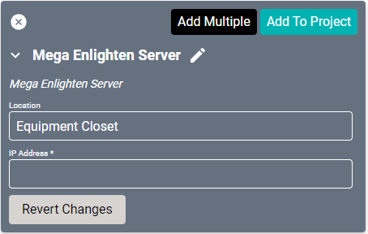
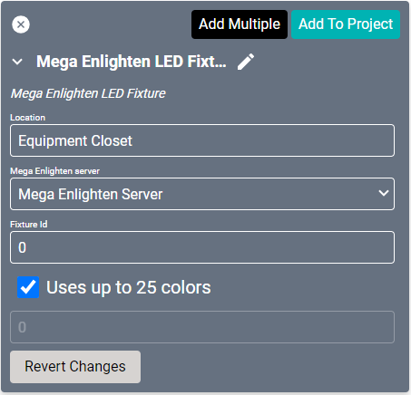

# Mega-Lite Enlighten Driver

Lighting drivers do not normally have connection settings. Once these are configured and added to the project, they are ready to go.

## Server Driver
We recommend you add the [server](https://mega.lighting/products/#Control) to your project before adding fixtures so that you can select the server in the fixture driver properties.

#### Properties

* **Name:** Name of the device.

* **Location:** Location of the device within the Project. New Locations can be created by selecting this field, typing in a new name, and then selecting the corresponding "Add New Tag" option or pressing Enter on your keyboard.

* **IP Address:** The destination IP address that SAVI will use when communicating with the device.

## LED Fixture Driver
Each [lighting fixture](https://mega.lighting/products/) will need a separate LED Fixture Driver. Each of these will be available in Facility View.

#### Properties

* **Name:** Name of the device.

* **Location:** Location of the device within the Project. New Locations can be created by selecting this field, typing in a new name, and then selecting the corresponding "Add New Tag" option or pressing Enter on your keyboard.

* **Mega Enlighten Server:** The server that the fixture is connected to.

* **Fixture id:** The Fixture ID found in the Enlighten Software

* **Uses up to 25 colors:** If this is true, use the custom colors to send more colors beyond the standard.
