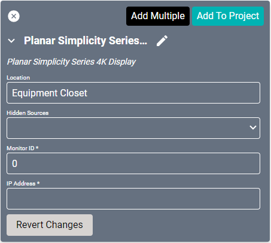
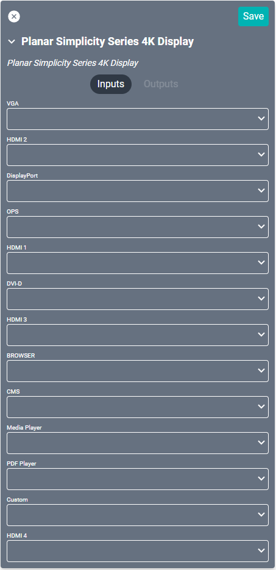

# Planar Simplicity Series 4K Display Driver
This driver is compatible with the [Simplicity line](https://www.planar.com/products/large-format-lcd-displays/simplicity-m/) of devices.

#### Properties

* **Name:** Name of the device.

* **Location:** Location of the device within the Project. New Locations can be created by selecting this field, typing in a new name, and then selecting the corresponding "Add New Tag" option or pressing Enter on your keyboard.

* **Hidden Sources:** Sources that should not be shown when selecting sources for this device.

* **Monitor ID:** Found and set in display's settings menu.

* **IP Address:** The destination IP address that SAVI will use when communicating with the device.

### Connections

##### Input

* **VGA:** Computer connection.

* **HDMI 2:** HDMI connection.

* **DisplayPort:** Computer connection.

* **OPS:** Optional Open-Pluggable Specification expansion slot.

* **HDMI 1:** HDMI connection.

* **DVI-D:** DVI connection. Not compatible with DVI-I cables.

* **HDMI 3:** HDMI connection.

* **BROWSER:** Network connection.

* **CMS:** Connects to the Content Management Software for digital signage.

* **Media Player:** USB connection that can play videos, photos and/or music.

* **PDF Player:** Loads and plays PDFs.

* **Custom:** Access to Android main menu.

* **HDMI 4:** HDMI connection.
