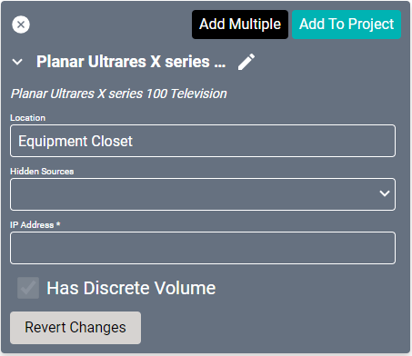
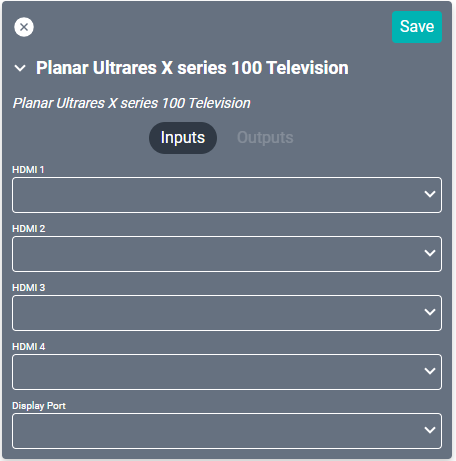

# Planar Ultrares X series 100 Television Driver
This driver is compatible with the [Ultrares X line](https://www.planar.com/products/large-format-lcd-displays/ultrares-x/) of devices.

#### Properties

* **Name:** Name of the device.

* **Location:** Location of the device within the Project. New Locations can be created by selecting this field, typing in a new name, and then selecting the corresponding "Add New Tag" option or pressing Enter on your keyboard.

* **Hidden Sources:** Sources that should not be shown when selecting sources for this device.

* **IP Address:** The destination IP address that SAVI will use when communicating with the device.

* **Has Discrete Volume:** If enabled, this audio zone has discrete audio capability.

### Connections

##### Input

* **HDMI (1-4):** HDMI connection.

* **DisplayPort:** Computer connection.
