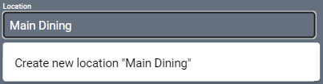

# Purelink HTX-4400-U Driver
This driver supports [this](https://www.purelinkav.com/product/ultra-hd-4x4-hdmi-to-hdbaset-matrix-switcher-with-poe/) 4 port HDBaseT matrix switch.

#### Properties

* **Name:** Name of the device.

* **Location:** Location of the device within the Project. New Locations can be created by selecting this field, typing in a new name, and then selecting the corresponding "Add New Tag" option or pressing Enter on your keyboard.

* **IP Address:** The destination IP address that SAVI will use when communicating with the device.

* **Command Throttle:** Specifies the number of milliseconds to wait between sending commands. Set to 500 by default.

#### Connections

##### Input

* **Input (1-4):** Up to four HDMI inputs.

##### Output

* **Output (1-4):** Up to four HDMI or HDBaseT outputs.
