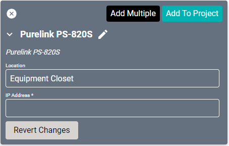
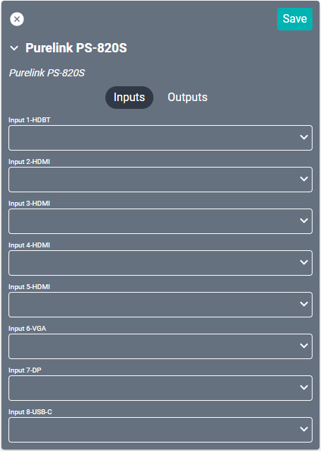
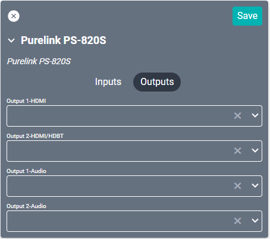

# Purelink PS-820S Driver
This driver supports [this](https://www.purelinkav.com/product/8x2-4k-60-seamless-presentation-switcher/) 8x2 4K presentation switch.

#### Properties

* **Name:** Name of the device.

* **Location:** Location of the device within the Project. New Locations can be created by selecting this field, typing in a new name, and then selecting the corresponding "Add New Tag" option or pressing Enter on your keyboard.

* **IP Address:** The destination IP address that SAVI will use when communicating with the device.

#### Connections

##### Input

* **Input 1 HDBT:** An HDBaseT ethernet input.

* **Input (2-5) HDMI:** Up to four HDMI inputs.

* **Input 6 VGA:** A VGA computer connection.

* **Input 7 DP:** A DisplayPort computer connection.

* **Input 8 USB-C:** A USB Type-C connection.

##### Output

* **Output 1 HDMI:** A dedicated HDMI output.

* **Output 2 HDMI/HDBT:** Configurable to either an HDMI or HDBaseT output.

* **Output (1-2) Audio:** Standard 3.5mm audio output.
