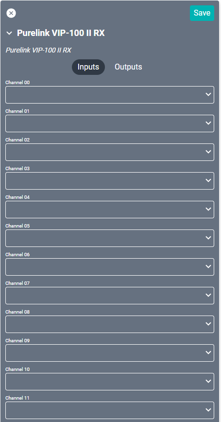
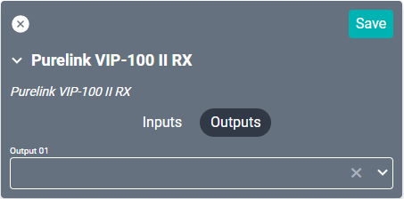

# Purelink VIP-100 II RX Driver

<!--
Future: include what controls the transmitters.
-->

This driver controls the [receiver](https://www.purelinkav.com/product/hdmi-over-ip-receiver-decoder-with-poe/) which must be configured to connect to Transmitters. Each transmitter is connected to a channel source and each receiver connects to the back of a display to allow switching between all available transmitters.

#### Properties

* **Name:** Name of the device.

* **Location:** Location of the device within the Project. New Locations can be created by selecting this field, typing in a new name, and then selecting the corresponding "Add New Tag" option or pressing Enter on your keyboard.

* **IP Address:** The destination IP address that SAVI will use when communicating with the device.

#### Connections

##### Input

* **Channel (00-63):** Up to sixty-four HDMI transmitters. Each transmitter should already be connected and configured.

##### Output

* **Output 01:** The HDMI output on the back of the receiver.
