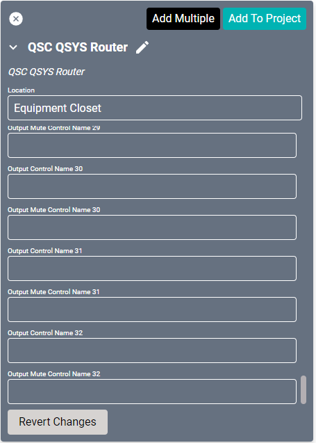

# QSC Q-SYS Drivers

Control for [Q-SYS products](https://www.qsys.com/products-solutions/) is separated into these two drivers; A volume level driver and a source routing driver.

### Level Driver
A Level driver is needed for every output you wish to control. When using the Router Driver as well, these level drivers must be set as the Alternate Volume Control in the Audio Zone. This driver can be used with other router drivers and still set as the Alternate Volume Control.

#### Properties

* **Name:** Name of the device.

* **Location:** Location of the device within the Project. New Locations can be created by selecting this field, typing in a new name, and then selecting the corresponding "Add New Tag" option or pressing Enter on your keyboard.

* **IP Address:** The destination IP address that SAVI will use when communicating with the device.

* **Username:** Username used to connect to the QSys Core. Leave blank if no login is used.

* **PIN:** PIN used to connect to the QSys Core. Leave blank if no login is used.

* **Max Gain:** Maximum amount of gain allowed. Set to 20 by default.

* **Min Gain:** Minimum amount of gain allowed. Set to 20 by default.

* **Gain Control Name:** What to name the gain control. This needs to match the named controls found in the Q-SYS Core system.

* **Mute Control Name:** What to name the mute control. This needs to match the named controls found in the Q-SYS Core system.

### Connections
If using this driver as an Alternate Volume Control, leave all connections blank.

##### Input

* **Input:** Connect to the output on the Router Driver you wish to control.

##### Output

* **Output:** Connect to an audio zone.

## Router Driver
#### Properties

* **Name:** Name of the device.

* **Location:** Location of the device within the Project. New Locations can be created by selecting this field, typing in a new name, and then selecting the corresponding "Add New Tag" option or pressing Enter on your keyboard.

* **IP Address:** The destination IP address that SAVI will use when communicating with the device.

* **Username:** Username used to connect to the QSys Core. Leave blank if no login is used.

* **PIN:** PIN used to connect to the QSys Core. Leave blank if no login is used.

* **Output Control Name (1-32)** What name to use for each output control. This needs to match the named controls found in the Q-SYS Core system.

* **Output Mute Control Name (1-32)** What name to use for each output mute control. This needs to match the named controls found in the Q-SYS Core system.

### Connections

##### Input

* **Input (1-32):** Up to thirty-two inputs.

##### Output

* **Output (1-32):** Up to thirty-two outputs.

----

## Media Stream Receiver
This driver allows changing the stream URL value.

#### Properties

* **Name:** Name of the device.

* **Location:** Location of the device within the Project. New Locations can be created by selecting this field, typing in a new name, and then selecting the corresponding "Add New Tag" option or pressing Enter on your keyboard.

* **IP Address:** The destination IP address that SAVI will use when communicating with the device.

* **Username:** Username used to connect to the QSys Core. Leave blank if no login is used.

* **PIN:** PIN used to connect to the QSys Core. Leave blank if no login is used.

* **URL Control Name:** What name to use for the URL control. This needs to match the named controls found in the Q-SYS Core system.

* **Channel (1-2) Gain Control Name:** What name to use for each gain control. This needs to match the named controls found in the Q-SYS Core system.

* **Channel (1-2) Mute Control Name:** What name to use for each mute control. This needs to match the named controls found in the Q-SYS Core system.

* **Enable Control Name:** What name to use for the enable control toggle setting. This needs to match the named controls found in the Q-SYS Core system.

### Connections

##### Output

* **Channel (1-2):** These are the two audio channels on the output in the QSC project. If the stream is mono, then both outputs will be the same. If the stream is stereo, then channels will be right and left.

----

## Snapshot
This driver allows reverting to a specific setting configuration in the Q-SYS Core system.

#### Properties

* **Name:** Name of the device.

* **Location:** Location of the device within the Project. New Locations can be created by selecting this field, typing in a new name, and then selecting the corresponding "Add New Tag" option or pressing Enter on your keyboard.

* **IP Address:** The destination IP address that SAVI will use when communicating with the device.

* **Username:** Username used to connect to the QSys Core. Leave blank if no login is used.

* **PIN:** PIN used to connect to the QSys Core. Leave blank if no login is used.
