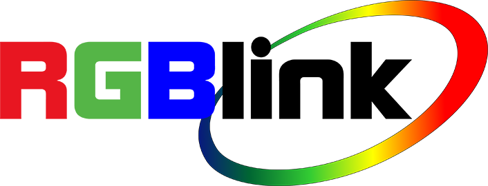
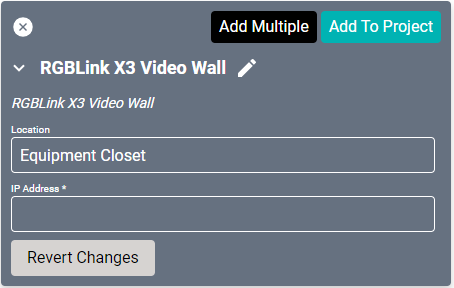
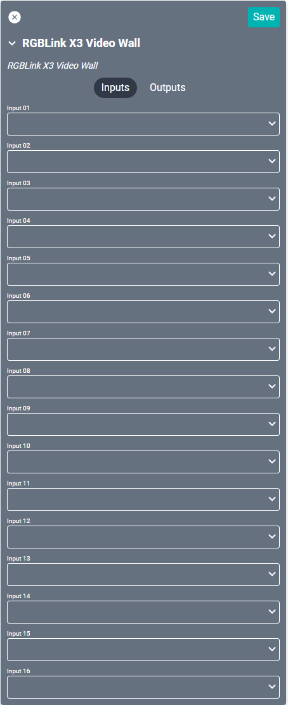
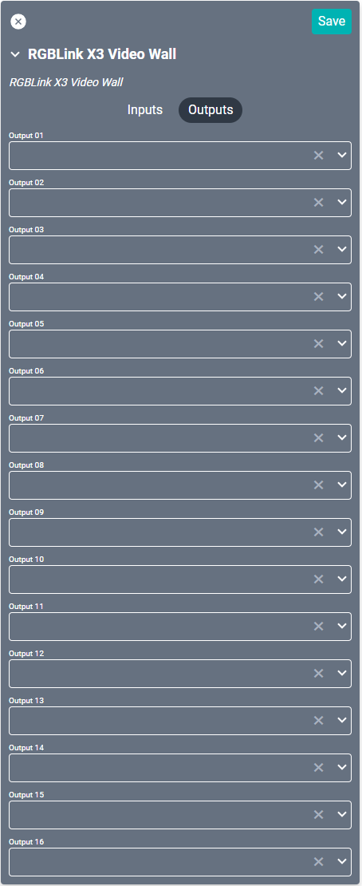
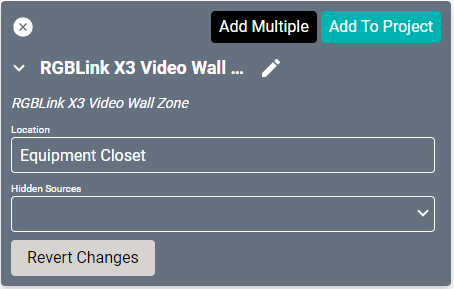
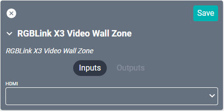

# RGBLink X3 Video Wall Drivers
This driver is specifically designed for the [X3 Video Wall](https://www.rgblink.com/productsinfo.aspx?id=73) device. It is meant to be used in conjunction with a [Video Wall Zone Placeholder](/Knowledge-Base/Creator/Drivers/Generic/video-wall-zone-driver.md). A Video Wall Zone driver should be used for each source layout in the RGBLink UI.

#### Properties

* **Name:** Name of the device.

* **Location:** Location of the device within the Project. New Locations can be created by selecting this field, typing in a new name, and then selecting the corresponding "Add New Tag" option or pressing Enter on your keyboard.

* **IP Address:** The destination IP address that SAVI will use when communicating with the device.

### Connections

##### Input

* **Input (01-16):** Up to sixteen sources.

##### Output

* **Output (01-16):** Up to sixteen outputs. Each output should be connected to an X3 Video Wall Zone driver.

<!--
## X3 Video Wall Zone
One of these drivers are needed for each layout in the RGB UI. Be sure to import your RGB project file into SAVI through the `/admin` page.

#### Properties

* **Name:** Name of the device.

* **Location:** Location of the device within the Project. New Locations can be created by selecting this field, typing in a new name, and then selecting the corresponding "Add New Tag" option or pressing Enter on your keyboard.

* **Hidden Sources:** The destination IP address that SAVI will use when communicating with the device.

### Connections

##### Input

* **HDMI:** HDMI source input.
-->
