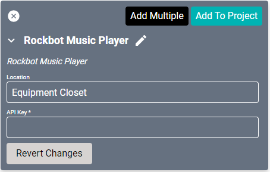
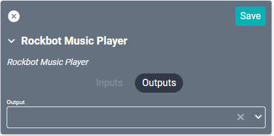

# Rockbot Driver
This driver provides interface control through SAVI for interacting with [Rockbot Music service](https://rockbot.com/). Provides access to artist and playlist searching, play/skip controls, and thumbs up/down feedback to Rockbot.

#### Properties

* **Name:** Name of the device.

* **Location:** Location of the device within the Project. New Locations can be created by selecting this field, typing in a new name, and then selecting the corresponding "Add New Tag" option or pressing Enter on your keyboard.

* **API Key:** The API Key for this device, obtained from Rockbot.
  >Contact Christopher Ezell at chris@rockbot.com to obtain your API Key.

### Connections

##### Output

* **Output:** Connects to the Input of the audio device used for routing (such as the SAVI DSP).
