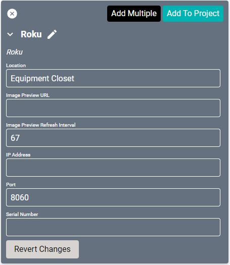

# Roku Driver
This driver is used as a satellite source for connecting to a [Roku](https://www.roku.com/) device.

#### Properties

* **Name:** Name of the device.

* **Location:** Location of the device within the Project. New Locations can be created by selecting this field, typing in a new name, and then selecting the corresponding "Add New Tag" option or pressing Enter on your keyboard.

* **Image Preview URL:** A link used to preview a streaming video source. If the driver is connected to a Stream.One, this field will auto-populate. This provides the appropriate URL to SAVI Preview in Facility View. Allowable: single image preview or Motion JPEG.
* **Image Preview Refresh Interval:** Determines how often the preview image should be refreshed.
    * If Image Preview URL refers to single image preview, specifies Refresh Interval in Milliseconds (default is 67 which is equal to 15 frames per second).
    * If Image preview URL refers to Motion JPEG, set to 0.

* **IP Address:** The destination IP address that SAVI will use when communicating with the device.

* **Port:** The IP address port that the device is open to. Set to 8060 by default.

* **Serial Number:** The serial number of the specific device.
