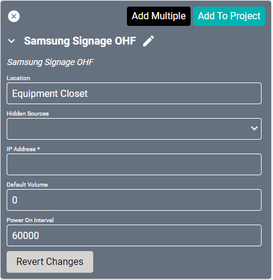
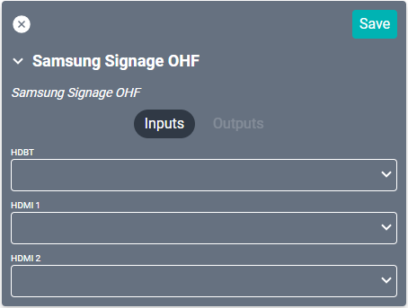
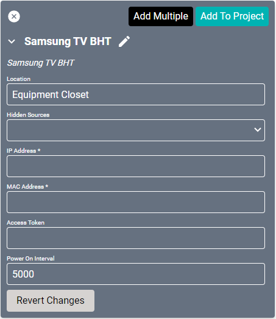
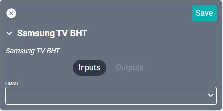

# Samsung Drivers
These drivers support the [OHF](https://displaysolutions.samsung.com/digital-signage/detail/1050/OH55F) and [BHT](https://displaysolutions.samsung.com/digital-signage/detail/1647/BH75T) lines of IP controlled displays. You may need to enable "Allow IP remote" in the display settings.

>**When adding these devices to the project, the display will receive a popup from the SAVI App to allow or deny connection. Allow this connection in order to connect to SAVI. Denying this request will require adding the connection manually in the display's menu.**

## Signage OHF
#### Properties

* **Name:** Name of the device.

* **Location:** Location of the device within the Project. New Locations can be created by selecting this field, typing in a new name, and then selecting the corresponding "Add New Tag" option or pressing Enter on your keyboard.

* **Hidden Sources:** Sources that should not be shown when selecting sources for this device.

* **IP Address:** The destination IP address that SAVI will use when communicating with the device.

* **Default Volume:** This is the volume level sent to the device when it is turned on.

* **Power On Interval:** The number of milliseconds to wait after sending ON. Set to 60000 (1 min) by default.

### Connections

##### Input

* **HDBT:** HDBaseT ethernet source.

* **HDMI (1-2):** Up to two HDMI sources.

----------------

## TV BHT
#### Properties

* **Name:** Name of the device.

* **Location:** Location of the device within the Project. New Locations can be created by selecting this field, typing in a new name, and then selecting the corresponding "Add New Tag" option or pressing Enter on your keyboard.

* **Hidden Sources:** The sources that should not be shown when selecting sources for this device.

* **IP Address:** The destination IP address that SAVI will use when communicating with the device.

* **MAC Address:** Media Access Control Address (read only).

* **Access Token:** Used to identify SAVI with the TV (read only).

* **Power On Interval:** The number of milliseconds to wait after sending ON. Set to 5000 (5 sec) by default.

### Connections

##### Input

* **HDMI:** HDMI source.
