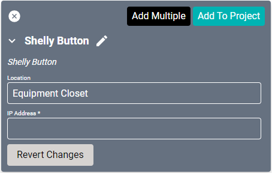

# Shelly Button Driver
This driver allows customers to execute SAVI macros by performing actions on a [Shelly Button 1](https://shelly.cloud/products/shelly-button-smart-home-automation-device/) device.

#### Properties

* **Name:** Name of the device.

* **Location:** Location of the device within the Project. New Locations can be created by selecting this field, typing in a new name, and then selecting the corresponding "Add New Tag" option or pressing Enter on your keyboard.

* **IP Address:** The destination IP address that SAVI will use when communicating with the device.
