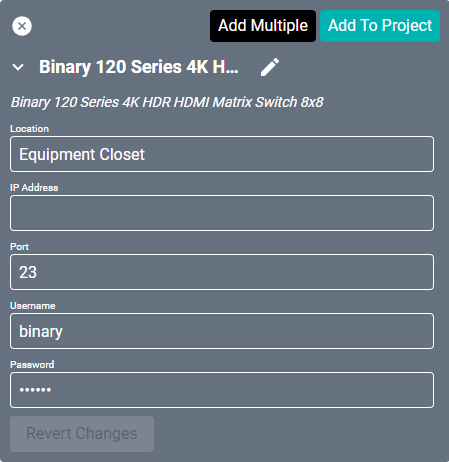
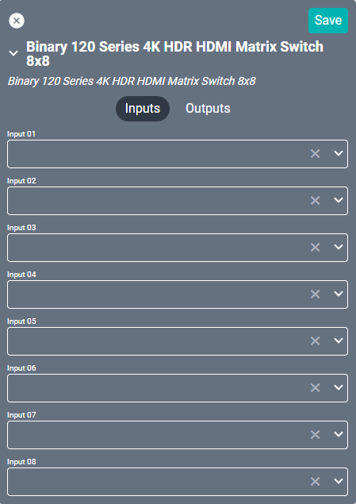
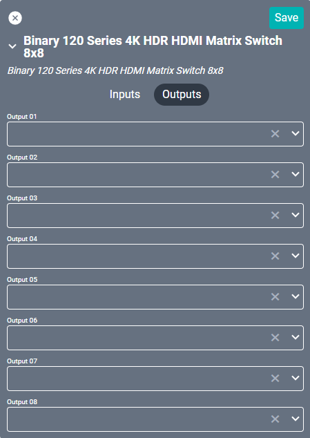

# Binary 120 Series Serial Matrix Switcher 8x8
This driver interfaces with the [Binary 120 Series](https://www.snapav.com/shop/en/snapav/binary-trade%3B-120-series-hdmi-matrix-switcher-with-hdmi-outputs-b-120-hdmatrix "Snap One Binary 120 Series") device. Specifications on the matrix itself can be found on the Snap One site.

#### Properties

* **Name:** Name of the device.

* **Location:** Location of the device within the Project. New Locations can be created by selecting this field, typing in a new name, and then selecting the corresponding "Add New Tag" option or pressing Enter on your keyboard.

* **IP Address:** The destination IP address that SAVI will use when communicating with the device.

* **Port:** The IP address port that the device is open to. Set to 23 by default.

* **Username:** Login username of the device.

* **Password:** Login password of the device.

### Connections

##### Input

* **RS232 In:** RS232 input.

* **Source Input (01-08):** Up to eight HDMI source inputs.

##### Output

* **CH Output (01-08):** Up to eight HDMI outputs.
