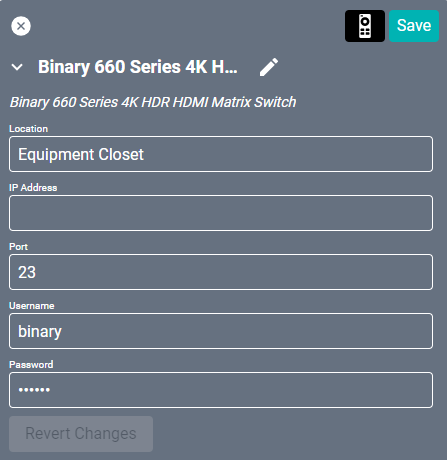
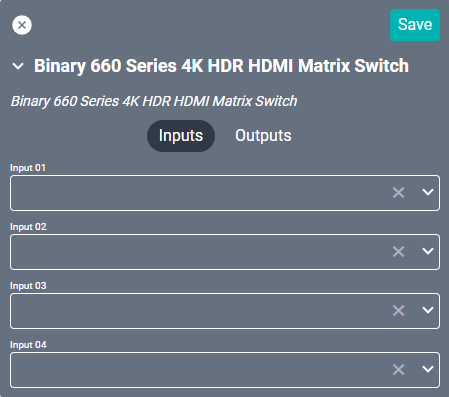
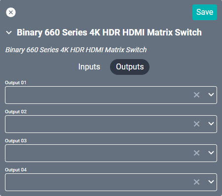

# Binary 660 Series IP Matrix Switcher 4x4
This driver interfaces with the [Binary 660 Series](https://www.snapav.com/shop/en/snapav/matrixes/binary-660-series-4k-hdr-hdmi-matrix-switcher-4x4-b-660-mtrx-4x4 "Snap One Binary 660 Series") device. Specifications on the matrix itself can be found on the Snap One site.

#### Properties

* **Name:** Name of the device.

* **Location:** Location of the device within the Project. New Locations can be created by selecting this field, typing in a new name, and then selecting the corresponding "Add New Tag" option or pressing Enter on your keyboard.

* **IP Address:** The destination IP address that SAVI will use when communicating with the device.

* **Port:** The IP address port that the device is open to. Set to 23 by default.

* **Username:** Login username of the device.

* **Password:** Login password of the device.

### Connections

##### Input

* **Input (01-04):** Up to four HDMI source inputs.

##### Output

* **CH Output (01-04):** Up to four HDMI outputs.
