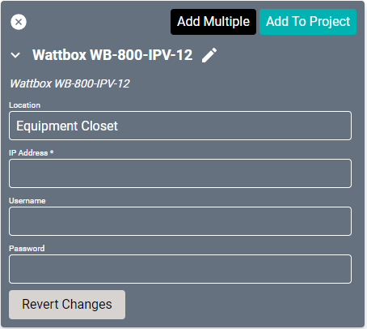
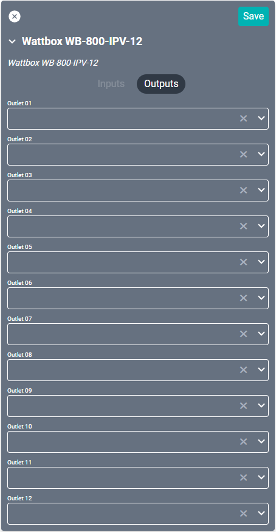

# Snap One Wattbox WB-800-IPVM-12 Driver

These drivers support the Snap One [Wattbox WB-800-IPVM-12](https://www.snapav.com/shop/en/snapav/wattbox-800-series-ip-power-conditioner-12-individually-controlled-metered-outlets-wb-800-ipvm-12-a "Wattbox WB-800-IPVM-12") power conditioner. This device can be controlled through macro commands. 

#### Properties

* **Name:** Name of the device.

* **Location:** Location of the device within the Project. New Locations can be created by selecting this field, typing in a new name, and then selecting the corresponding "Add New Tag" option or pressing Enter on your keyboard.

* **IP Address:** The destination IP address that SAVI will use when communicating with the device.

* **Username:** Login username of the device.

* **Password:** Login password of the device.

### Connections

##### Output

* **Output (01-12):** Up to twelve power outputs.
