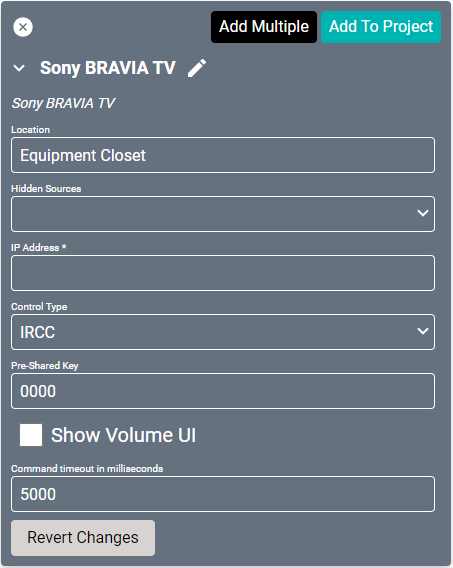
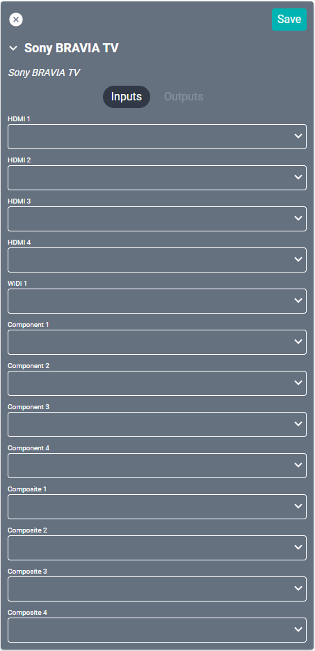

# Sony BRAVIA TV Driver
This driver works with any display in the [BRAVIA line](https://electronics.sony.com/tv-video/televisions/c/all-tvs).

The Display requires the following settings to be configured:
1. On the TV navigate to "Settings > Network > Home Network Setup"
2. Set the following settings:
   1. Remote device/Renderer > On
   2. IP Control > Authentication > Normal and Pre-Shared Key
   3. Remote device/Renderer > Enter Pre-Shared Key > 0000 (or whatever you want your PSK Key to be)
   4. Remote device/Renderer > Simple IP Control > On
3. Select **Yes**

#### Properties

* **Name:** Name of the device.

* **Location:** Location of the device within the Project. New Locations can be created by selecting this field, typing in a new name, and then selecting the corresponding "Add New Tag" option or pressing Enter on your keyboard.

* **Hidden Sources:** Sources that should not be shown when selecting sources for this device.

* **IP Address:** The destination IP address that SAVI will use when communicating with the device.

* **Control Type:** Which type of command is sent to the display. Choose the type that is supported for that display. See the [BRAVIA Knowledge Center](https://pro-bravia.sony.net/develop/integrate/ip-control/index.html) for more information.
    * **IRCC:** Compatible with InfraRed Compatible Control over Internet Protocol.
    * **Simple:** Compatible with the TCP based low level protocol.

* **Pre-Shared Key:** A fixed secret string based authentication is required to access BRAVIA. This setting is only available in BRAVIA software when Authentication method is set to “Pre-Shared Key” or “Normal and Pre-Shared Key.”

* **Show Volume UI:** Enables or disables if the volume bar is shown on the display during volume changes.

* **Command timeout in milliseconds:** How long SAVI will wait for a response before timing out. Set to 5000 (5 sec) by default.

* **Ircc: Cancel:** Lists the command sent. This field may be edited.

* **Simple: Cancel:** Lists the command sent. This field may be edited.

### Connections

##### Input

* **HDMI (1-4):** Up to four HDMI inputs.

* **WiDi 1:** Wireless Display input.

* **Component (1-4):** Up to four component sources.

* **Composite (1-4):** Up to four composite sources.
