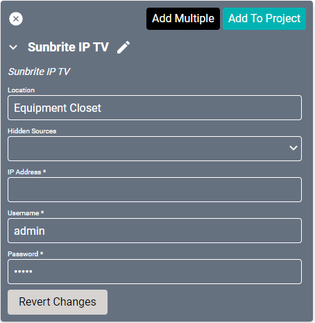
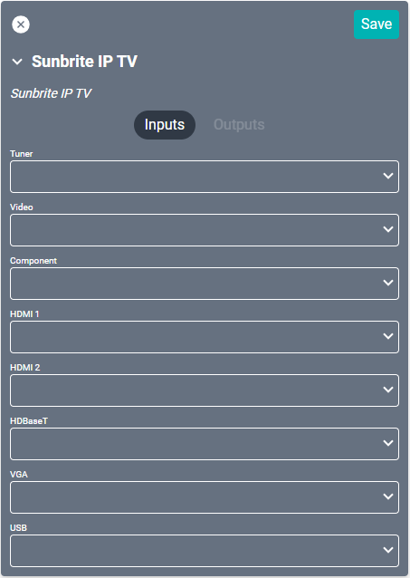

# Sunbrite IP TV Driver
This driver may be used for any [Sunbrite Veranda series](https://www.sunbritetv.com/categories/products/televisions/veranda-outdoor-tvs.html) IP controlled display.

#### Properties

* **Name:** Name of the device.

* **Location:** Location of the device within the Project. New Locations can be created by selecting this field, typing in a new name, and then selecting the corresponding "Add New Tag" option or pressing Enter on your keyboard.

* **Hidden Sources:** Sources that should not be shown when selecting sources for this device.

* **IP Address:** The destination IP address that SAVI will use when communicating with the device.

* **Username:** Login username of the device.

* **Password:** Login password of the device.

### Connections

##### Input

* **Tuner:** Coaxial TV tuner source.

* **Video:** Generic video source.

* **Component:** Component source.

* **HDMI (1-2):** Up to two HDMI inputs.

* **HDBaseT:** HDBaseT ethernet source.

* **USB:** Standard USB source.
