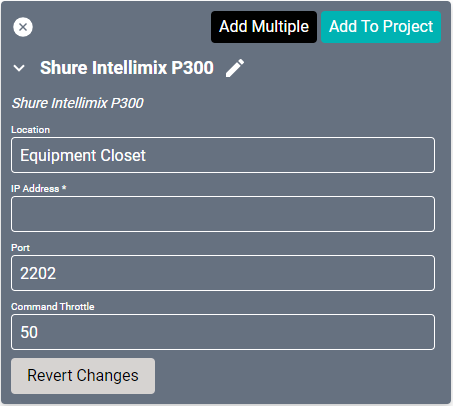
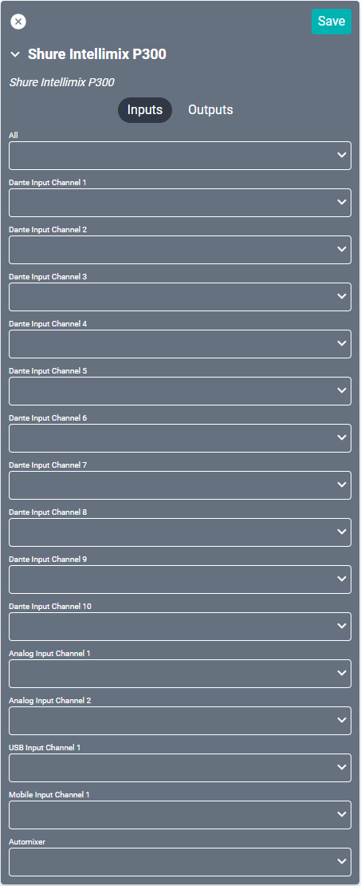
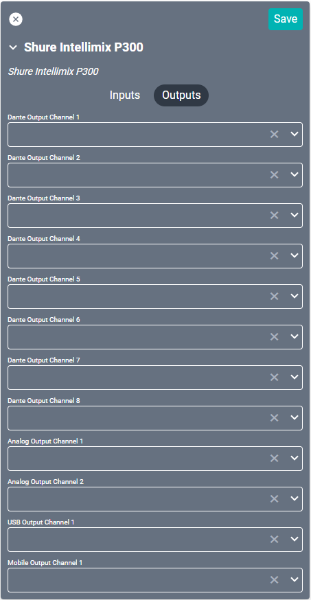

# Shure Intellimix P300 Driver
This driver interfaces with this specific [Shure  audio conferencing processor](https://www.shure.com/en-US/products/mixers/p300 "Atlona video matrix"). Specifications on the device can be found on the Shure site.

#### Properties

* **Name:** Name of the device.

* **Location:** Location of the device within the Project. New Locations can be created by selecting this field, typing in a new name, and then selecting the corresponding "Add New Tag" option or pressing Enter on your keyboard.

* **IP Address:** The destination IP address that SAVI will use when communicating with the device.

* **Port:** The IP address port that the device is open to. Set to 2202 by default.

* **Command Throttle:** Specifies the number of milliseconds to wait between sending commands. Set to 50 by default.

### Connections
Most inputs and outputs are assignable in the Receiver settings of the Shure UI. Setup will include choosing which physical connections are being used for each of the assignable inputs or outputs.

##### Input

* **All:** Used if a source is available to all inputs.

* **Dante Input Channel (1-10):** Digital inputs through ethernet network with Dante.

* **Analog Input Channel (1-2):** Euroblock inputs.

* **USB Input Channel 1:** USB port access. May be used for either input or output.

* **Mobile Input Channel 1:** Standard 3.5mm audio jack.

* **Automixer:** Devices which should be routed through the Shure UI Automixer.

##### Output

* **Dante Output Channel (1-8):** Digital outputs through ethernet network.

* **Analog Output Channel (1-2):** Euroblock outputs.

* **USB Output Channel 1:** USB port access. May be used for either input or output.

* **Mobile Output Channel 1:** Standard 3.5mm audio jack.
