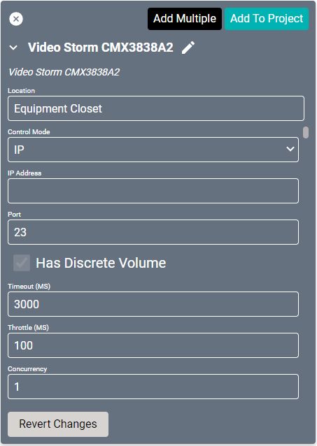
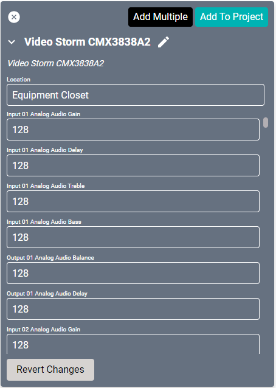
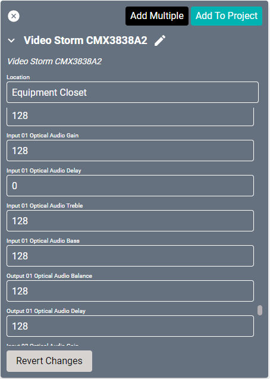
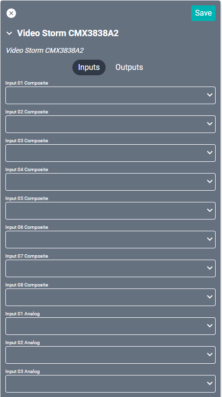
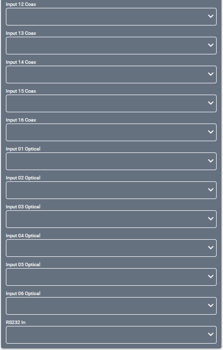
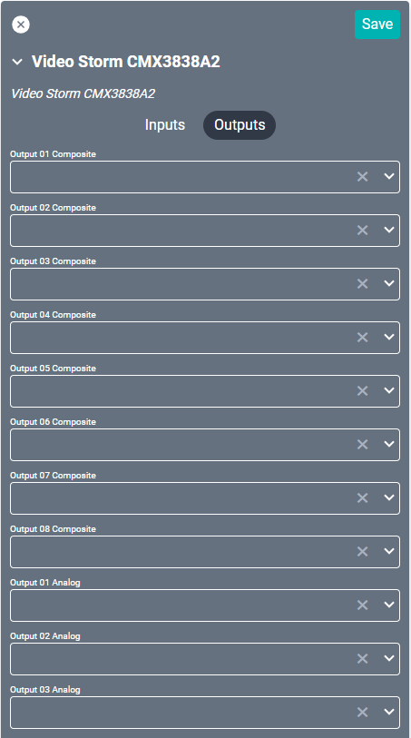
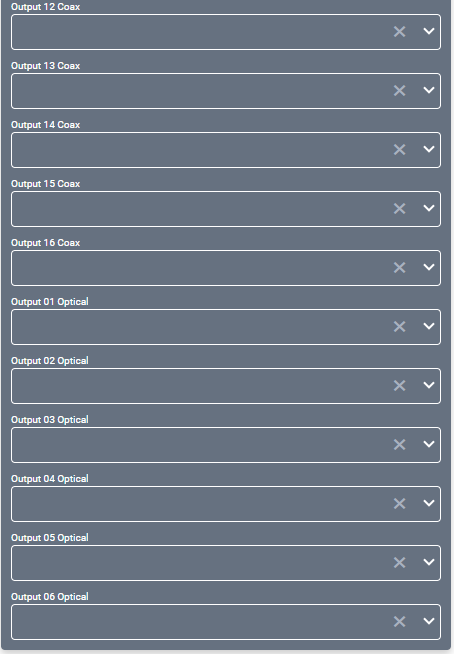

# Video Storm CMX3838A2 Driver
This driver interfaces with this specific [38x38 matrix switch](https://www.video-storm.com/proddetail.php?prod=CMX3838A2). 

#### Properties

* **Name:** Name of the device.

* **Location:** Location of the device within the Project. New Locations can be created by selecting this field, typing in a new name, and then selecting the corresponding "Add New Tag" option or pressing Enter on your keyboard.

* **Control Mode:** Chose how the DSP communicates.
  * **IP** - Network connection.
  * **RS232** - Serial connection. Requires connection through a Connect I/O or other device.
    >**Baud Rate** is statically set to `9600` and does not need to be configured.

* **IP Address:** The destination IP address that SAVI will use when communicating with the device.

* **Port:** The IP address port that the device is open to. Set to 23 by default.

* **Has Discrete Volume:** This is always enabled.

* **Timeout (MS):** The amount of time in milliseconds to allow SAVI to connect to the device, send the command, then disconnect before timing out. If the device has 2 way feedback, it can short circuit this time if data is received before the timeout is reached. The max total time to send a command is timeout + throttle. Set to 3000 (3 sec) by default.

* **Throttle (MS):** The amount of time in milliseconds to wait in-between sending commands to the device. The max total time to send a command is timeout + throttle. Set to 100 by default.

* **Concurrency:** The number of TCP connections the device can handle without crashing. This number will translate to the amount of commands that can be sent in a given time. Set to 1 by default.

* **Input (01-16) Analog Audio Gain:** Set to 128 by default. Range is 00 to 255.

* **Input (01-16) Analog Audio Delay:** Introduces an audio delay (1 = 1/60th of a second). Set to 128 by default. Range is 00 to 255.

* **Input (01-16) Analog Audio Treble:** Set to 128 by default. Range is 00 to 255.

* **Input (01-16) Analog Audio Bass:** Set to 128 by default. Range is 00 to 255.

* **Output (01-16) Analog Audio Balance:** Set to 128 by default. Range is 00 to 255.

* **Output (01-16) Analog Audio Delay:** Introduces an audio delay (1 = 1/60th of a second). Set to 128 by default. Range is 00 to 255.

* **Input (01-16) Coax Audio Gain:** Set to 128 by default. Range is 00 to 255.

* **Input (01-16) Coax Audio Delay:** Set to 128 by default. Range is 00 to 255.

* **Input (01-16) Coax Audio Treble:** Set to 128 by default. Range is 00 to 255.

* **Input (01-16) Coax Audio Bass:** Set to 128 by default. Range is 00 to 255.

* **Output (01-16) Coax Audio Balance:** Set to 128 by default. Range is 00 to 255.

* **Output (01-16) Coax Audio Delay:** Introduces an audio delay (1 = 1/60th of a second). Set to 128 by default. Range is 00 to 255.

* **Input (01-06) Optical Audio Gain:** Set to 128 by default. Range is 00 to 255.

* **Input (01-06) Optical Audio Delay:** Introduces an audio delay (1 = 1/60th of a second). Set to 128 by default. Range is 00 to 255.

* **Input (01-06) Optical Audio Treble:** Set to 128 by default. Range is 00 to 255.

* **Input (01-06) Optical Audio Bass:** Set to 128 by default. Range is 00 to 255.

* **Output (01-06) Optical Audio Balance:** Set to 128 by default. Range is 00 to 255.

* **Output (01-06) Optical Audio Delay:** Introduces an audio delay (1 = 1/60th of a second). Set to 128 by default. Range is 00 to 255.

### Connections

##### Input

* **Input (01-08) Composite:** L/R audio sources.

* **Input (01-16) Analog:** Analog audio sources.

* **Input (01-16) Coax:** Digital coaxial audio sources.

* **Input (01-06) Optical:** Digital optical audio sources.

* **RS232 In:** Serial input for control.

##### Output

* **Output (01-08) Composite:** L/R audio outputs.

* **Output (01-16) Analog:** Analog outputs.

* **Output (01-16) Coax:** Digital coaxial audio outputs.

* **Output (01-06) Optical:** Digital optical audio outputs.
