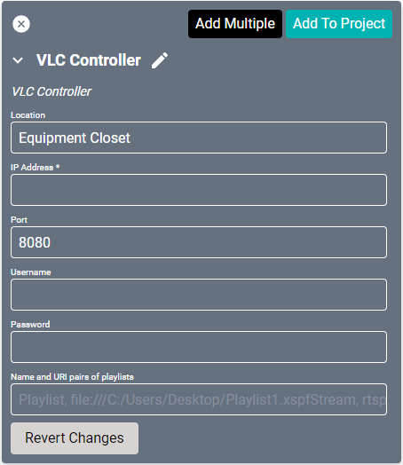

# VLC Controller Drivers

This driver is used when running [VLC media player](https://www.videolan.org/vlc/) as a streaming server on a PC. The PC running VLC must be on the same network as SAVI.

#### Properties

* **Name:** Name of the device.

* **Location:** Location of the device within the Project. New Locations can be created by selecting this field, typing in a new name, and then selecting the corresponding "Add New Tag" option or pressing Enter on your keyboard.

* **IP Address:** The destination IP address that SAVI will use when communicating with the device.

* **Port:** The IP address port that the device is open to. Set to 8080 by default.

* **Username:** Login username of the device.

* **Password:** Login password of the device.

* **Name and URI pairs of playlists:** Format will be `[name], [uri]` without brackets and with a new line for each. URIs are case sensitive and can reference a file path of a playlist (with .xspf extension), a audio or video file, or even a network stream.
    >***URIs will create a list of playlists that can be controlled via macros.***
