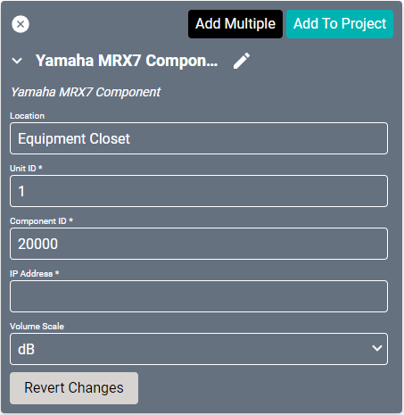
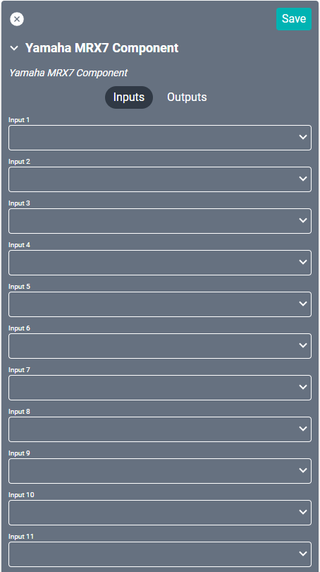
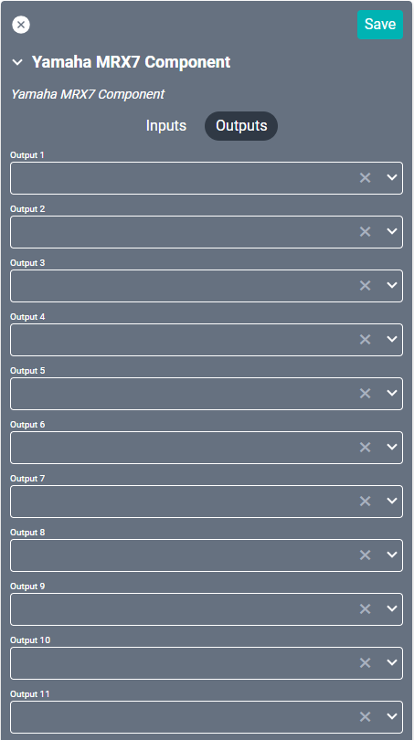

# Yamaha MRX7 Component Driver
This driver has limited control over faders, matrix mixers, routers, and source selectors in the [MRX7](https://usa.yamaha.com/products/proaudio/processors/mrx7-d/index.html) setup. Configure the components separately in the **MTX-MRX Editor** and download the "Remote Control List." This list can be uploaded to the SAVI Admin page by selecting the "Import MRX7 CSV File" option. 

One of these drivers will need to be used for each different component of the MRX7 project. 

#### Properties

* **Name:** Name of the device.

* **Location:** Location of the device within the Project. New Locations can be created by selecting this field, typing in a new name, and then selecting the corresponding "Add New Tag" option or pressing Enter on your keyboard.

* **Unit ID:** Set to 1 by default.

* **Component ID:** Set to 20000 by default.

* **IP Address:** The destination IP address that SAVI will use when communicating with the device.

* **Volume Scale:** Sets the volume indicators to either dB or Percent.

### Connections

##### Input

* **Input (01-32):** Up to thirty-two audio inputs.

##### Output

* **Output (01-32):** Up to thirty-two audio outputs.
