

# Yamaha MTX Drivers

These [Matrix Processors](https://usa.yamaha.com/products/proaudio/processors/mtx/index.html) (the Yamaha MTX3 and MTX5-D) are controlled by two separate drivers that can be configured together or independently. The Matrix driver controls the Input (Channel) audio and the Zone audio levels. The Zone driver controls the Output audio levels.

## Yamaha MTX Matrix
This driver controls inputs (i.e. microphones), outputs (zones), and cross points (matrix). Typically, SAVI does not send volume control directly to a device, but rather will defer to the closest amplifier/matrix in the connection.

#### Properties
<a href="../../../Assets/Knowledge-Base/Creator/Drivers/yamaha-mtx-matrix-01.png">
  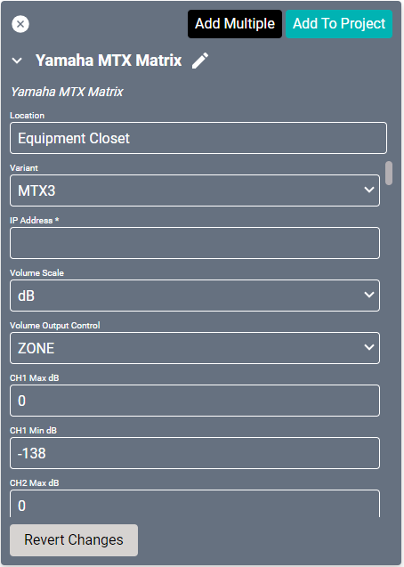
</a>
<a href="../../../Assets/Knowledge-Base/Creator/Drivers/yamaha-mtx-matrix-02.png">
  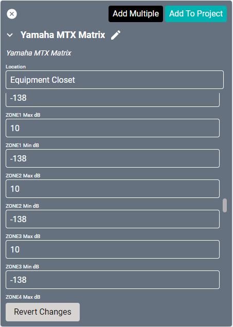
</a>

* **Name:** Name of the device.

* **Location:** Location of the device within the Project. New Locations can be created by selecting this field, typing in a new name, and then selecting the corresponding "Add New Tag" option or pressing Enter on your keyboard.

* **Variant:** Allows choosing either the MTX3 or MTX5-D.

* **IP Address:** The destination IP address that SAVI will use when communicating with the device.

* **Volume Scale:** Sets the volume indicators to either dB or Percent.

* **Volume Output Control:** This setting determines what faders are handling volume control. OUT: Router screen OUT# and ZONE: Matrix screen ZONE#. Min and max dB values apply to either. If using ZONE, min and max dB values apply to the connected Yamaha MTX Matrix Control port or, if not found, the Zone Number below (Connected Zone Port or Zone Number is 5 - use OUT5 min/max dB).

* **CH(1-24) Max dB:** Limits the maximum allowable gain/volume range. These should match values set in Yamaha. Set to 0 by default. Range of 0 to -138.

* **CH(1-24) Min dB:** Limits the minimum allowable gain/volume range. These should match values set in Yamaha. Set to -138 by default. Range of 0 to -138.

* **Zone(1-24) Max dB:** Limits the maximum allowable gain/volume range. These should match values set in Yamaha. Set to 0 by default. Range of 0 to -138.

* **Zone(1-24) Min dB:** Limits the minimum allowable gain/volume range. These should match values set in Yamaha. Set to -138 by default. Range of 0 to -138.

>Recommended settings:
>
>* **Volume Scale:** `dB`
>* **Volume Output Control:** `ZONE`
>For each input channel CHx (CH1 through CH24), start off with these values, adjust accordingly:
>
>* **Max dB:** `0`
>* **Min dB:** `-25`
>For each output zone ZONEx (ZONE1 through ZONE24), start off with these values, adjust accordingly:
>
>* **Max dB:** `3`
>* **Min dB:** `-25`

## Yamaha MTX Zone

* **Zone control:** controls volume, recommend named both MTX Zone number and the SAVI Audio Zone

#### Properties
<a href="../../../Assets/Knowledge-Base/Creator/Drivers/yamaha-mtx-zone.png">
  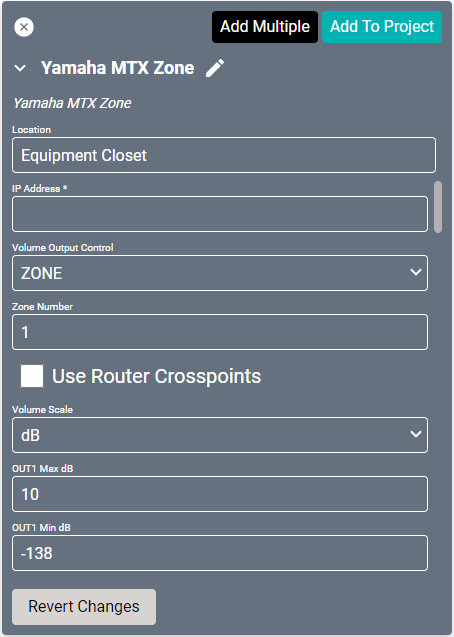
</a>

* **Name:** Name of the device.

* **Location:** Location of the device within the Project. New Locations can be created by selecting this field, typing in a new name, and then selecting the corresponding "Add New Tag" option or pressing Enter on your keyboard.

* **IP Address:** The destination IP address that SAVI will use when communicating with the device.

* **Volume Output Control:** This setting determines what faders are handling volume control. OUT: Router screen OUT# and ZONE: Matrix screen ZONE#. Min and max dB values apply to either. If using ZONE, min and max dB values apply to the connected Yamaha MTX Matrix Control port or, if not found, the Zone Number below (Connected Zone Port or Zone Number is 5 - use OUT5 min/max dB).

* **Zone Number:** This is only required/used if you did not connect this device to a Yamaha MTX Matrix driver, otherwise it will be ignored.

* **Use Router Crosspoints:** When enabled, SAVI will send additional commands to enable/disable crosspoints in the Yamaha router.

* **Volume Scale:** Sets the volume indicators to either dB or Percent.

* **OUT(1-24) Max dB:** Limits the maximum allowable gain/volume range. These should match values set in Yamaha. Set to 10 by default. Range of 10 to -138.

* **OUT(1-24) Min dB:** Limits the minimum allowable gain/volume range. These should match values set in Yamaha. Set to -138 by default. Range of 10 to -138.

>Recommended Settings:
>
>* **Volume Output Control:** `ZONE`
>* **Zone Number:** `desired MTX Zone`
>* **Volume Scale:** `dB`
>Update OUTx Min dB/OUTx Max dB for corresponding Zone values, start off with these values, adjust accordingly:
>
>* **Max dB:** `3`
>* **Min dB:** `-26`

### Connections Using Both MTX Drivers
When Connecting the Yamaha MTX drivers to other devices, you can start from the sources and work forward, start at the audio zones and work backward, or start at the Yamaha MTX itself and work outward.

>Be sure to save after making changes!

##### Connecting From the MTX Drivers
<a href="../../../Assets/Knowledge-Base/Creator/Drivers/yamaha-mtx-matrix-input.png">
  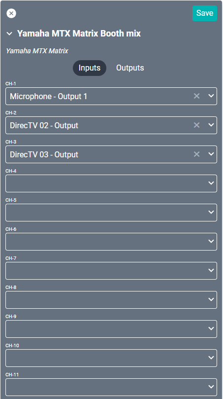
</a>
<a href="../../../Assets/Knowledge-Base/Creator/Drivers/yamaha-mtx-matrix-output.png">
  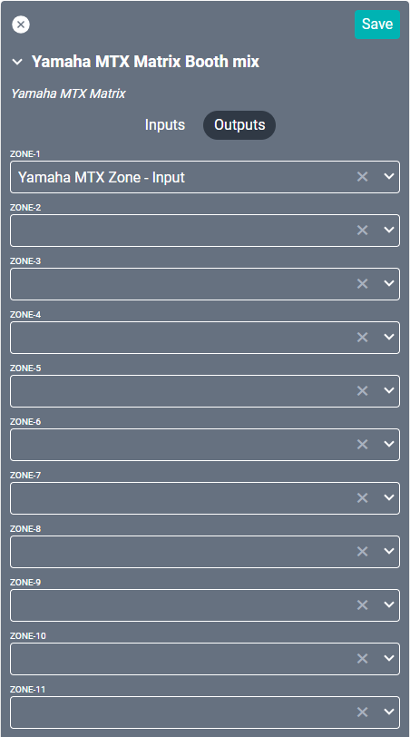
</a>
<a href="../../../Assets/Knowledge-Base/Creator/Drivers/yamaha-mtx-zone-output.png">
  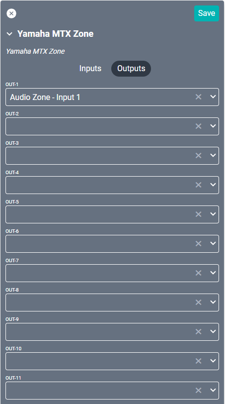
</a>
<a href="../../../Assets/Knowledge-Base/Creator/Drivers/yamaha-mtx-zone-input.png">
  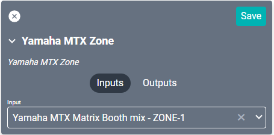
</a>

When using both the Matrix and Zone drivers, you will need to configure the **Matrix Output** to connect to the **Zone Input**. You can do this from either driver.

From the Matrix driver, under Inputs, select any sources desired from the dropdown lists. This is a searchable field, so you can type to search.

>***Note: SAVI references Input channels CH1 through CH24 in the Matrix driver. The Yamaha API reference corresponds to the same order as SAVI, but will "group" stereo connections together and simply "counts from the left".  This reference/grouping may change based on configuration of Yamaha.  For example:***
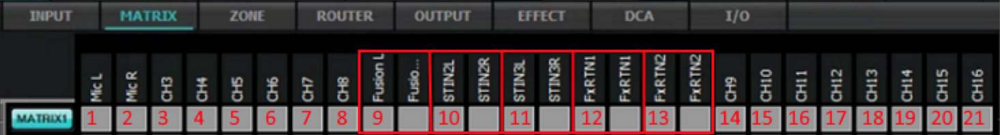

From the Zone driver, under Outputs, select any audio endpoints desired from the dropdown lists. This is a searchable field, so you can type to search.

If you are not utilizing one of the drivers then setup will be slightly different. When using only the Matrix driver, connect to desired audio endpoints instead of the Zone driver under Outputs. When using only the Zone driver, connect to the desired source under Input.

##### Connecting From Sources
<a href="../../../Assets/Knowledge-Base/Creator/Drivers/source-connected-to-yamaha.png">
  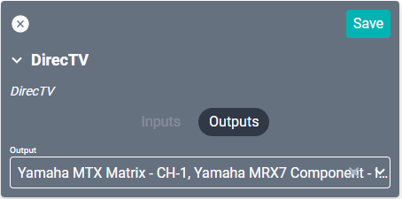
</a>

If you choose to form the connection to the Yamaha MTX driver from the Source, then simply select the Matrix driver from the Output field on that Source.

##### Connecting From A SAVI Audio Zone
<a href="../../../Assets/Knowledge-Base/Creator/Drivers/audio-zone-to-yamaha-connection-02.png">
  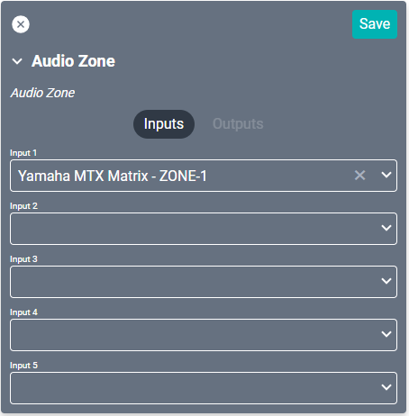
</a>
<a href="../../../Assets/Knowledge-Base/Creator/Drivers/audio-zone-to-yamaha-connection-solo.png">
  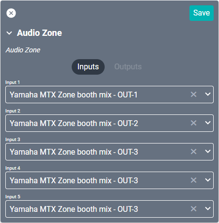
</a>

If you choose to form the connection to the Yamaha MTX driver from the Audio Endpoint, then simply select the correct driver from the Input field on that Endpoint. Remember to connect to the Zone driver if you are using it or both, but to connect to the Matrix driver if you are only using that one.

>***Note: When using the Yamaha MTX Zone driver, it will need to be set as the Alternate Volume Control in the Audio Zone driver as well. This is done under the Equipment category. Select the appropriate OUTx from the Yamaha MTX Zone driver.***
<a href="../../../Assets/Knowledge-Base/Creator/Drivers/audio-zone-alternate-volume-control.png">
  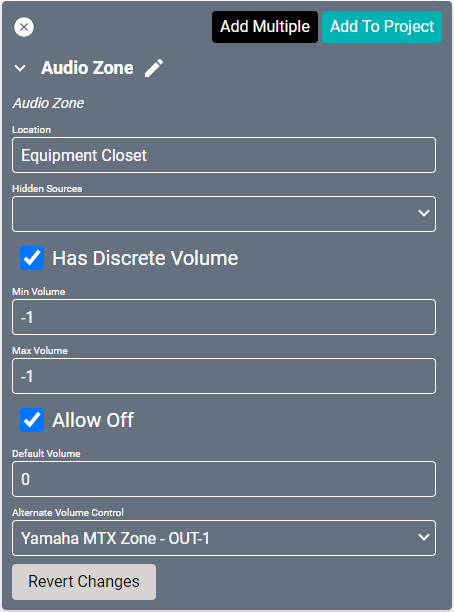
</a>
>
>***Be sure to populate Default Volume as well. And Volume Presets should be configured in Facility View.***

### Connections Using Only the MTX Matrix Driver

##### Connecting From the MTX Matrix Driver

<a href="../../../Assets/Knowledge-Base/Creator/Drivers/yamaha-mtx-matrix-output-solo.png">
  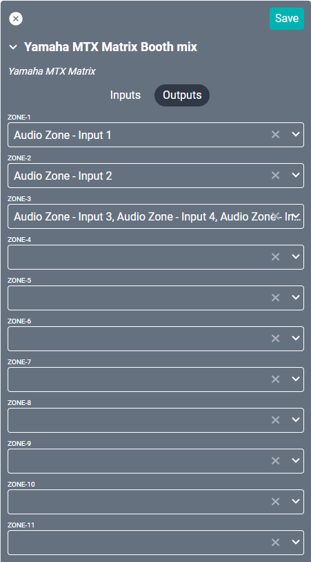
</a>

When using only the Matrix driver, you will need to configure the Matrix Outputs and Inputs to connect to the desired audio endpoints and sources.

From the Matrix driver, under Inputs, select any sources desired from the dropdown lists. This is a searchable field, so you can type to search.

From the Matrix driver, under Outputs, select any endpoints desired from the dropdown lists. This is a searchable field, so you can type to search.

>***Note: SAVI references Input channels CH1 through CH24 in the Matrix driver. The Yamaha API reference corresponds to the same order as SAVI, but will "group" stereo connections together and simply "counts from the left".  This reference/grouping may change based on configuration of Yamaha.  For example:***

##### Connecting From Sources

If you choose to form the connection to the MTX driver from the Source, then simply select the Matrix driver from the Output field on that Source.

##### Connecting From A SAVI Audio Zone

If you choose to form the connection to the Yamaha MTX driver from the Audio Endpoint, then simply select the Matrix driver from the Input field on that Endpoint.

### Connections Using Only the MTX Zone Driver

##### Connecting From the MTX Driver

<a href="../../../Assets/Knowledge-Base/Creator/Drivers/yamaha-mtx-zone-input-solo.png">
  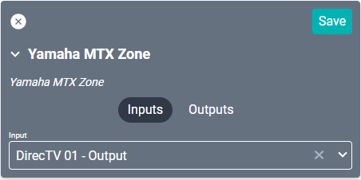
</a>

When using only the Zone driver, you will need to configure the Zone Input to connect to the desired source.

From the Zone driver, under Outputs, select any audio endpoints desired from the dropdown lists. This is a searchable field, so you can type to search.

From the Zone driver, under Inputs, select any audio sources desired from the dropdown lists. This is a searchable field, so you can type to search.

##### Connecting From Sources

If you choose to form the connection to the Yamaha MTX driver from the Source, then simply select the Zone driver from the Output field on that Source.

##### Connecting From A SAVI Audio Zone
<a href="../../../Assets/Knowledge-Base/Creator/Drivers/audio-zone-to-yamaha-connection.png">
  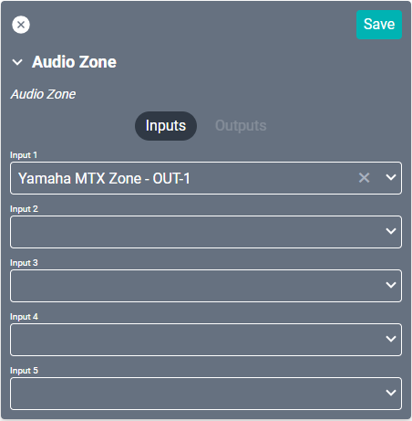
</a>

If you choose to form the connection to the Yamaha MTX driver from the Audio Endpoint, then simply select the Zone driver from the Input field on that Endpoint.

>***Note: When using the Yamaha MTX Zone driver, it will need to be set as the Alternate Volume Control in the Audio Zone driver as well. This is done under the Equipment category. Select the appropriate OUTx from the Yamaha MTX Zone driver.***

>
>***Be sure to populate Default Volume as well. And Volume Presets should be configured in Facility View.***
