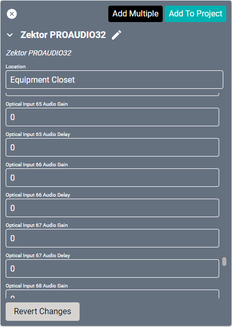

# Zektor ProAudio 32 Driver
This driver interfaces with this specific [Zektor audio matrix](https://www.pulse-eight.com/p/212/proaudio-32 "Zektor audio matrix"). Specifications on the matrix itself can be found on the Pulse Eight site.

#### Properties

* **Name:** Name of the device.

* **Location:** Location of the device within the Project. New Locations can be created by selecting this field, typing in a new name, and then selecting the corresponding "Add New Tag" option or pressing Enter on your keyboard.

* **IP Address:** The destination IP address that SAVI will use when communicating with the device.

* **Port:** The IP address port that the device is open to. Set to 50005 by default.

* **Has Discrete Volume:** This is always enabled.

* **Analog Input (01-80) Audio Gain:** The number corresponds to dB. Set to 0 by default.

* **Analog Input (01-80) Audio Delay:** Introduces an audio delay in milliseconds. Set to 0 by default.

#### Connections

##### Input

* **Analog Input (01-32):** L/R audio source.

* **Coax Input (33-64):** Digital coaxial source.

* **Optical Input (65-80):** Digital optical source.

##### Output

* **Analog Output (01-32):** Digital coaxial output.

* **Coax Output (01-32):** Digital optical output.
