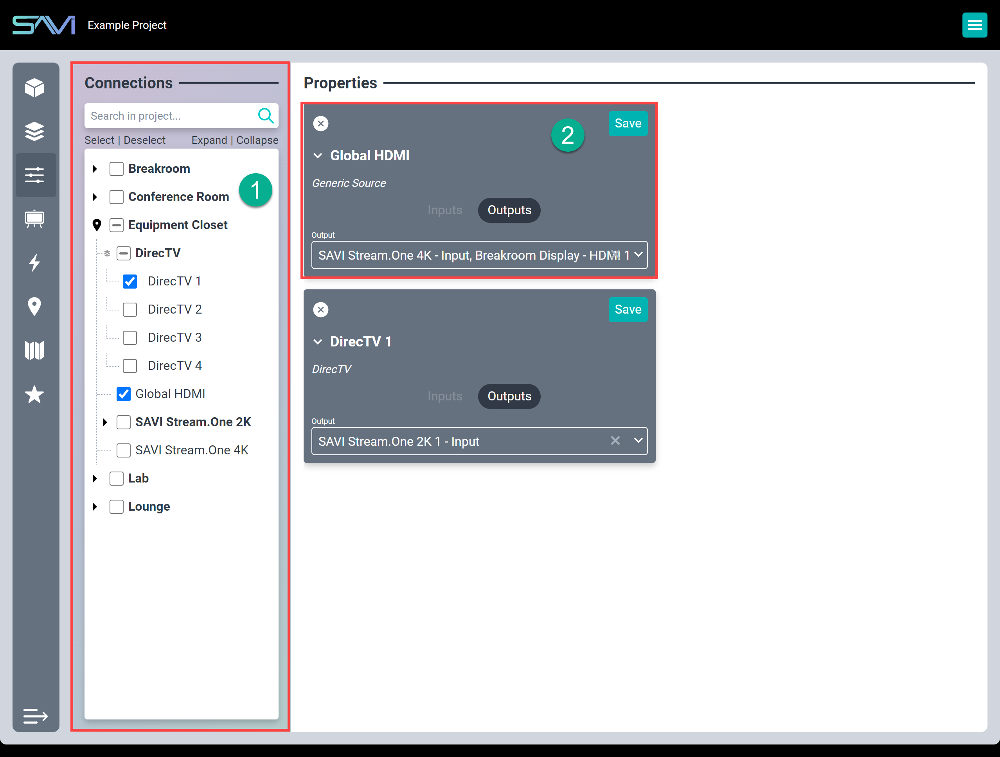

# Creator Connections

#### Connections properties
1. **Flexbar:** Lists the equipment drivers that have been added to the project.
2. **Driver Properties:** Displays connection properties for selected drivers.

Connections are the “glue that binds.” They describe to SAVI how the cabling and logical connections are arranged.

Connections can be made from either 'end' (for instance: selecting a DirecTV device and connecting the output to a STREAM.One or selecting the STREAM.One and connecting the input to a DirecTV device). Bulk connections can also be performed by selecting multiple of the same type of device and connecting them all to an input or output.

>***Why does SAVI allow connecting different output types to input types?  Ease of use.  E.g. HDMI output to Stereo input?  If an HDMI audio de-embedder is used, there is no need to describe to the system about the conversion.  Simply make the connection, done!***

### Creating Connections

1. Search for the device in the search bar  or browse through the list and select it
2. Choose **Input** or **Output**
3. Select desired connection field
4. Search for or select one or more desired drivers
5. Click **SAVE**
