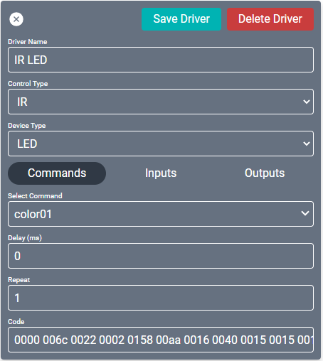

# Creator Equipment

This section lists all included drivers for hardware and virtual components. These are all of your sources, endpoints. or other devices (e.g., displays, lighting fixtures, audio zones, audio/video mixers). Select the desired driver, populate the corresponding attributes, and either **Add To Project** or **Add Multiple**. Add 1, 10, 100, or more devices to your project in seconds! 

#### Equipment properties
1. **Add Equipment:** Lists the equipment drivers that can be added to the project.
2. **Equipment in Project:** Lists all equipment already added to the project.
3. **Properties:** Displays the selected equipment properties. Multiple drivers may be selected and edited at once.
4. **Auto Discovery:**  Can scan for connected STREAM.Ones and LG webOS displays (restricted to versions 3.X and 4.X) that **Do Not** already have SAVI installed. The range defaults to the same IP as the server.

>***Note: You can select the section headers to resize or minimize them for easier browsing.***

## Adding A Device
1. Search for the device in the search bar  or browse through the list for it.
    * The driver list is extensive so browsing through them may take some time. Utilize the search bar to quickly find drivers.
2. Select the device.
3. Rename the device driver as desired.
4. Choose a location from the dropdown or type one in to add it to the Location list.

>***Note: Equipment Closet is the only Location by default. You can type a new location in the field to add it to your list of locations.***

5. Fill out any required fields (marked with an asterisk) in the driver.
6. After Properties are filled out, click either **ADD TO PROJECT** or **ADD MULTIPLE**.
    * **ADD TO PROJECT:** Add driver to project.
    * **ADD MULTIPLE:** Allows programmer to choose Quantity, starting number, whether or not to increment IP address, and whether or not to auto number entries.

### Add Multiple properties
1. **Quantity:** The number to be added to the name and incremented based on the "auto-rename" toggle.
2. **Increment IP Address:** Enable to also increase the last octet of the IP address for each new driver.
3. **Start Number:** What number to add to the first driver and count up from.
4. **Auto-Rename:** Enable to add a number to the end of the driver name. This begins with the **Start Number** and counts up equal to the **Quantity**. If disabled then each device will have an identical name.

These options may change depending on what the driver supports. For example, LG webOS drivers don't have an IP address and Mega Enlighten LED Fixture has fixture ID instead of IP address.

The Start Number is what will be added to the end of the Name of the first device, increasing incrementally a number of times equal to the Quantity. This is only performed if Auto-Rename is enabled.

>Example: If you've already added 4 of 10 DirecTV sources then you'd change the **Start Number** to 5 and the **Quantity** to 6.

## Adding a Device with Auto-Discover
You can search for STREAM.One or LG webOS devices by using the Auto Discovery feature. The results will be listed by IP address and Serial Number. 

1. Select Auto-Discover.
2. Edit the IP Range | Start and End addresses as needed.
3. Click Scan Now and wait for the scan to complete.
4. Select one or more STREAM.Ones and/or LG webOS Displays.
5. For STREAM.Ones, simply click Add To Project.
   * Devices will be added to the Equipment Closet and named "Stream.One SERIAL-NUMBER"
6. For LG webOS Displays, click Install SAVI App.
   * Wait for the display to reboot.

<!--

You can also add drivers by searching in the field or browsing through the list. Most drivers will require the device’s IP address, but some may require a URL or other identifier instead. A few may even require the username and password for the connected device. Each card’s mandatory fields will have an asterisk, and you will need to fill those for the source to work correctly.

>***Note: There are quite a few drivers so browsing through them may take some time. A breakdown of each driver can be found under their specific Knowledge Base pages.***

Once the driver is added to the project, it will appear in the lower window of the Flexbar. The listings will be nested in categories by location and type, arranged alphabetically. Selecting a category will expand it, revealing any nested categories or drivers. Additionally, any created drivers can be selected and **Duplicated** or **Removed** as well as multiple devices selected and edited in bulk.

-->

#### Common Properties
Most drivers will require the device’s IP address, but some may require a URL or other identifier instead. A few may even require the username and password for the connected device. Each driver's mandatory fields will be marked with an (*), and you will need to fill those for it to work correctly. 

These are some of the more common properties found in Equipment Drivers:

* **Name:** Name of Device.
* **Location:** Location of Device within Project.  Endpoints located within common rooms will automatically be queryable within Facility View.  New Locations can be created by selecting field, typing in a new name, and then selecting corresponding "Add New Tag" option or pressing Enter on your keyboard.

* **IP Address:** Network address of device.
* **Hidden Sources:** Sources that should not be shown when selecting sources for this device.

## Adding A Driver

To created a new driver for a device, click the **Create Custom Driver** button in the bottom of the **Add Equipment** field. The driver will appear in the properties section like normal.

#### Common Properties

* **Driver Name:** Name of the driver (changes the default name).

* **Control Type:** Switches between IR and Serial.

* **Device Type:** Switches between the different types of devices that can be controlled.
    * **TV:** IR/Serial enabled TV.
    * **LED:** IR/Serial enabled LED.
    * **Satellite:** Configures device as an IR/Serial source (such as a satellite box or other source selector).
    * **A/V Switch:** This can be anything with an input and output that needs to be routed (e.g., an HDMI matrix switch).

* **Select Command:** Sets the command when activating the driver.
    * There is a list of available commands that control the device. These are common remote and color settings options and will need specific codes for each command.
    * **Delay (ms):** How long of a pause in milliseconds before the command executes.
    * **Repeat:** How many times the command should repeat.
    * **Code:** The alphanumeric code for the specific IR command.

* **Inputs/Outputs:** Add multiple inputs and outputs and select the type of connection for each. Use the checkbox to rename them. These inputs and outputs must correspond to physical ports on the device.

## Editing A Driver

Some drivers are able to be edited for custom configurations. These drivers will have a **pencil icon** on the right side of their listing in the Add Equipment field. Clicking that icon will open the driver with the default editable fields.

#### Common Properties

* **Driver Name:** Name of the driver (changes the default name).

* **Control Type:** Switches between IR and Serial.

* **Device Type:** Switches between the different types of devices that can be controlled.
    * **TV:** IR/Serial enabled TV.
    * **LED:** IR/Serial enabled LED.
    * **Satellite:** Configures device as an IR/Serial source (such as a satellite box or other source selector).
    * **Switcher:** This can be anything with an input and output that needs to be routed (e.g., an HDMI matrix switch).

* **Select Command:** Sets the command when activating the driver.
    * There is a list of available commands that control the device. These are common remote and color settings options and will need specific codes for each command.
    * **Delay (ms):** How long of a pause in milliseconds before the command executes.
    * **Repeat:** How many times the command should repeat.
    * **Code:** The alphanumeric code for the specific IR command.

* **Inputs/Outputs:** Add multiple inputs and outputs and select the type of connection for each. Use the checkbox to rename them. These inputs and outputs must correspond to physical ports on the device.
