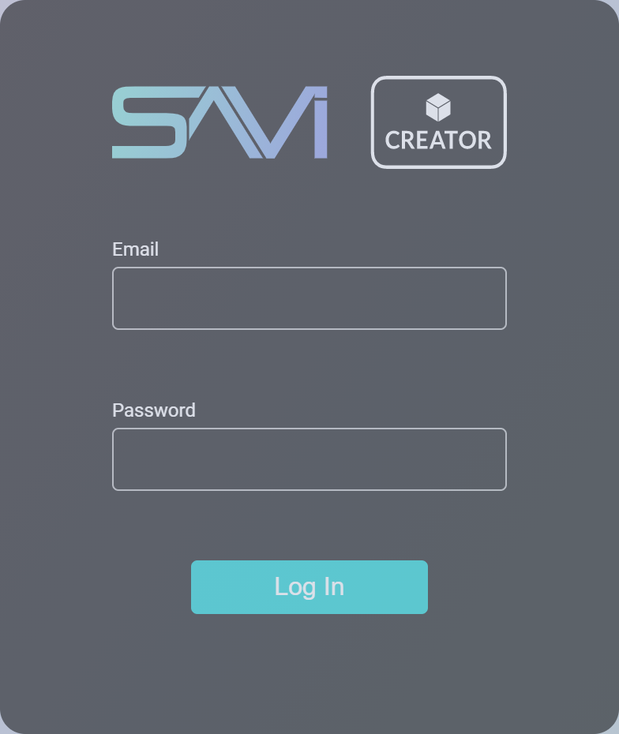
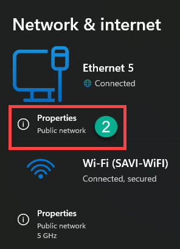
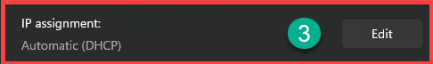
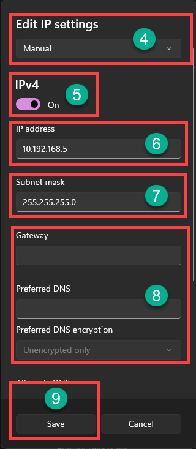
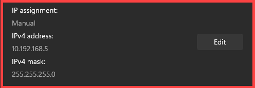
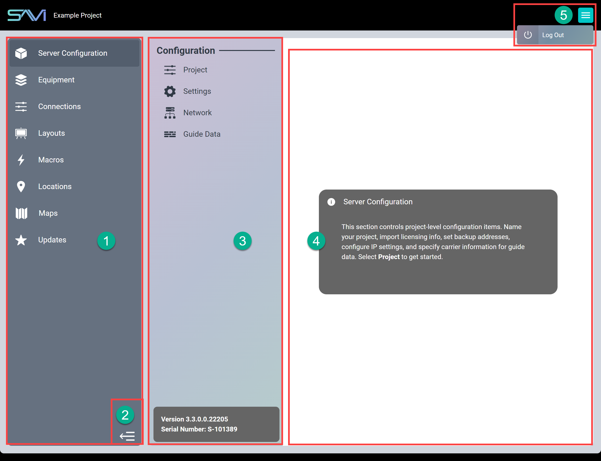

# Getting Started With Creator

## Requirements
As Creator is prepackaged with SAVI 3, you must have a SAVI Server Pro installed and connected to your network to access Creator. SAVI 3 itself does not require internet access, but it does require connection to a local network for access to the User Interface (internet access **is** required for certain features, such as guide data and remote support). It also requires any device with access to a modern internet browser, such as a tablet, laptop, or
desktop.

>***Note: The connecting device must have internet access in order to authenticate your login to Creator.***

## Initial Login

The entirety of the SAVI 3 UI is accessible through any modern browser by navigating to the correct IP address and entering a valid Username and Password. The SAVI 3 IP Address is set to a static IP address by default:

>`SAVI Server Pro Default Static IP: 10.192.168.1`

>`SAVI Creator Address: 10.192.168.1/creator`

>`SAVI Backup Server Default Static IP: 10.192.168.2`

In order to connect to this default IP, you will need to be on the same subnet.

>`10.192.168.1/creator`

On first login, you will be greeted with the login window pictured above. Your credentials are your SAVI Dealer ID and Password.

### Setting your device IP on Windows to connect to SAVI Server Pro:

1. Navigate to your device's Network Settings by going to Settings > Network & Internet
2. Click on Properties for one of your connections

  

3. Click Edit next to IP assignment

  

4. Set IP settings to Manual
5. Toggle on IPv4
6. Configure the IP address to **10.192.168.XX**
    * Replace the **XX** with a number between 3 and 254 that's not already used by another device
    * You must still have access to the internet through some other means (a Wi-Fi connection should be sufficient otherwise you will need a hard-line connection to your switch)
7. Set your Subnet Mask to **255.255.255.0**
8. You can leave all other settings blank
9. Save your settings and then try to connect to SAVI Server Pro through your browser by navigating to the above IP (10.192.168.1/creator)

  
  

On first login, you will be greeted with the login window (right). Your credentials are your SAVI Dealer ID and Password.

If you don't have a SAVI Dealer ID and Password setup, please contact your Dealer Admin to create one. Otherwise, please reach out to SAVI Sales.

A successful login will place you on the home screen. The project categories are listed on the left-hand side in the **Sidebar** and selecting any of them will reveal additional settings. Start at the top, work your way down, and voilà! A powerful commercial user interface in minutes instead of days or weeks.

## Interface

1. **Sidebar**: Lists each main category for the project.
2. **Collapse Sidebar:** Click this button to collapse the Sidebar. Click it again to expand a collapsed Sidebar.
3. **Flexbar:** Lists subcategories, new or connected devices, or other selectable information dependent on the selected main category in the Sidebar. Displays software version and serial number when in the Server Configuration or Updates sections. Selecting an item in the Flexbar will alter what appears in the Data Window.
4. **Data Window:** The white region displays the selected content's configurable fields (e.g., driver properties, layout properties, macros).
5. **Menu:** Reveals the log out feature.

The areas work much like a nested tree structure. Selecting something in the first changes what is displayed in the second which then can change the third.

When first navigating to Creator, only the Sidebar will be populated. Selecting a category in that list will reveal the Flexbar and Data Window. For instance, selecting Server Configuration will display the Configuration subcategories in the Flexbar. Selecting Project will display the project configuration settings in the Data Window.
