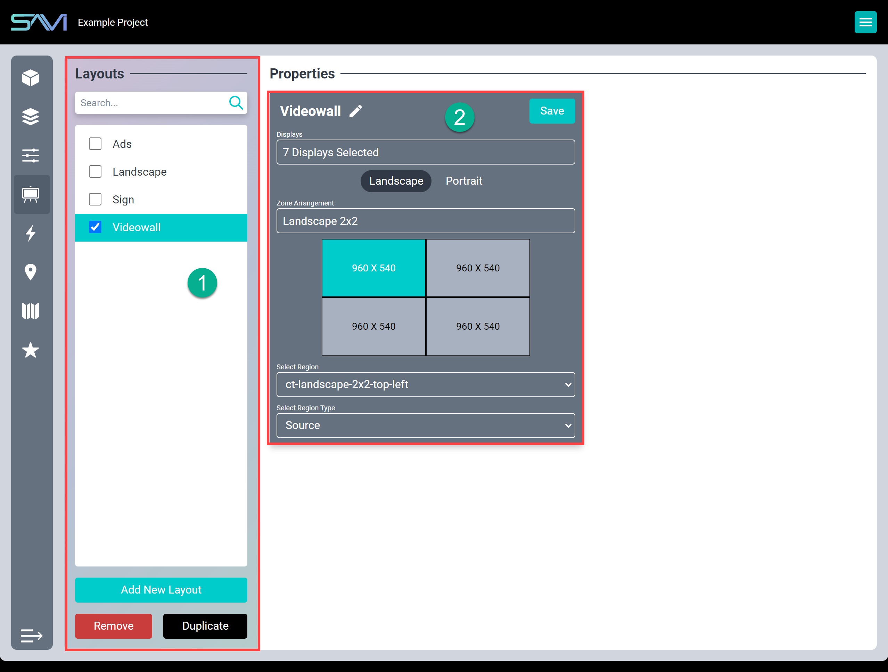
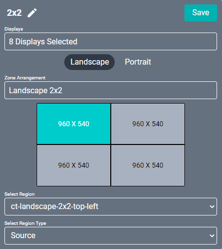

# Creator Layouts

## Layout Properties
1. **Flexbar:** Lists the layouts that have been configured for the project.
2. **Layout Properties:** Displays properties for selected layouts.

Layouts are exclusively for Canvas Displays and offer a way to customize the arrangement content. Layouts can
be applied to multiple displays across the project by selecting the displays field and searching for any displays.
Each zone of the layout can be set to display different content based on the region type.

### Region Type
* Source: Displays a selected source in Facility View
* Video: Displays a multicast URL video stream
* SAVI Show: Displays an image or slideshow from SAVI Show
* Image: Displays an image from a web URL
* Line In: Displays content from one of the physical display inputs
* URL: Displays content from a URL (requires starting with http:// or https://)
* VNC: Utilizes the VNC standard to display a virtualized monitor (requires a VNC server)
* Display Specific Region (1-4): Displays specified input from the respective Display Specific Region in each LG webOS display driver

## Creating A Layout
1. Select **Add New Layout** at the bottom of the Flexbar
2. Name your layout
3. From the **Displays** field, search or browse for all the displays that might use this layout and select them

  

4. Click out of the field to close it
5. Select either Landscape or Portrait orientation
     * Either 90 or 270 rotation are required for portrait landscapes to display correctly. This will need to be set in each display driver
6. Select the **Zone Arrangement** field to choose your layout configuration
7. Select one of the zones now depicted below Zone Arrangement or select from the Select Region field
8. Select a region type
9.  Some region types will have an additional Content field that will need to be selected or filled as required

>***Note: Displays can have any number of Layouts so no need to feel restrictive when assigning them.***

## Using YouTube playlists
YouTube playlists may be used in a layout by choosing the URL region type. There are some limitations to supported links:

* Livestreams are supported
* Playlists must be set to public
* Some videos / playlists will have the message “Video Unavailable” if it is restricted
  * This is a setting on individual videos or playlists
* When setting up a layout, only **ONE** region can be set up as a Video type with a YouTube URL
  * More YouTube streams may cause the display to reboot constantly
* When using a YouTube URL region, no more than **TWO** streams of **any type** may be used
  * Additional streams may cause one or more regions to display a black screen
* YouTube videos may not be visable using the Dashboard view as the iFrame is not capturable