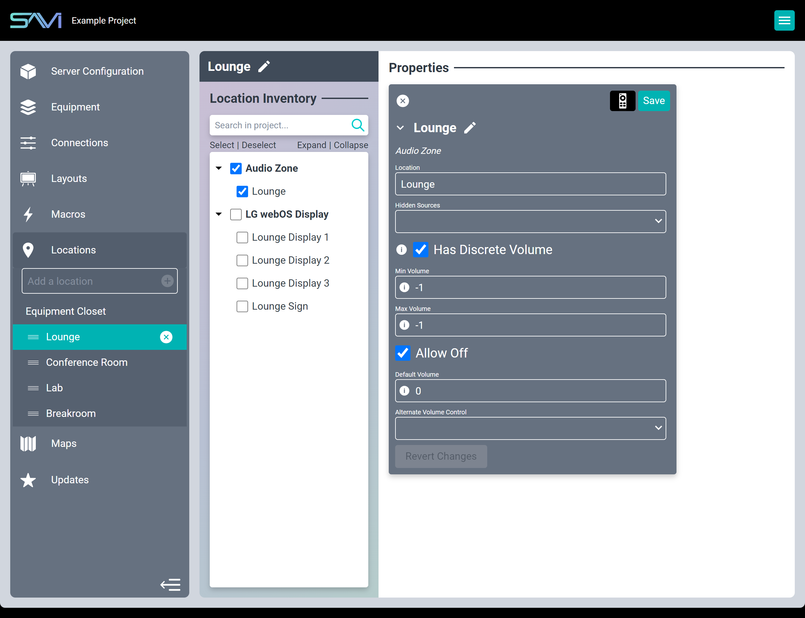

# Creator Locations

Locations allow you to easily see everything in their respective zones and areas. They are assigned in each driver (Equipment Closet is the default location) for easy categorization. 

Drag-and-drop to rearrange locations in Facility View (excluding Equipment Closet as that location is not displayed in Facility View). They can be renamed by selecting the Location and clicking the pencil icon in the Flexbar. You can delete a Location by selecting it and clicking the "X" icon in the Sidebar.

>***Note: All drivers within a deleted location will be reassigned to Equipment Closet***

It’s worth mentioning that some installers prefer to start with Locations, creating all their rooms and zones first before continuing with Equipment and so-on. Some prefer to work room-by-room, creating their Location and then creating the Equipment for that room before moving on to the next.

Creator is meant to make your project creation and maintenance easy, so feel free to experiment with the order you do things in and do it the way that works for you!