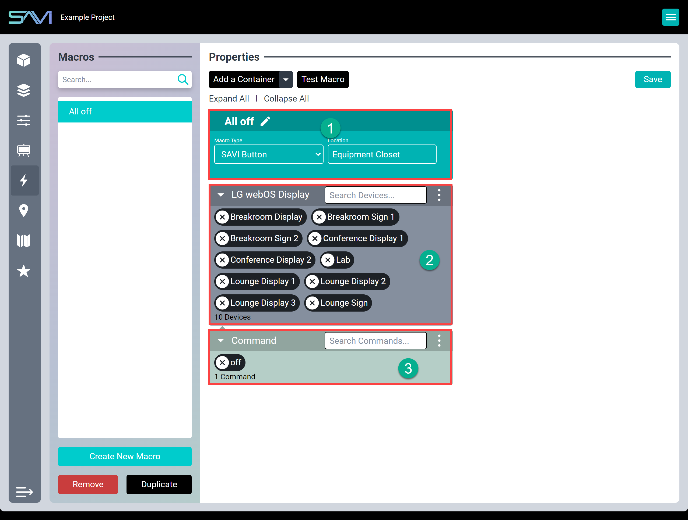

# Creator Macros

Macros automate custom commands to perform a large variety of tasks. They can be scheduled to execute at specific times and days, when certain other events happen, or initiated by a user. Common uses include setting devices for venue openings, closings, and special events. Each container within a macro performs a set task that applies to one or more devices. There is no limit on the number of containers that can be strung together to execute tasks.

#### Macro properties
1. **Macro Header:** Contains the macro title, macro type, and location. Macros can be one of the following types:
     * SAVI Button: Macro is a clickable button within Facility View
     * Schedule: Macro executes at specific times/days*
     * Event: Macro executes when a specific event happens*
2. **Container:** What drivers are affected.
3. **Command:** What action(s) are sent to the container.

## Creating A Macro

1. Start by clicking **CREATE NEW MACRO**
2. Name your Macro something descriptive
3. Choose the type of Macro this will be
    * **SAVI Button:** A selectable button in Facility View
    * **Schedule:** initiated at a specific time and/or on specific days
    * **Device Event:** triggered by some specific event
4. Choose a location for this Macro (or type one in)
5. Click **Add a Container**
    * **Device Container:** performs a task
    * **Delay:** allows a delay in milliseconds, seconds, or minutes (used between Device Containers)
6. In Device Container, search for the device(s) you want to be affected by the Macro
7. The Command container will appear, and you can search or browse the executable commands by clicking in the search field
8. Select one or more commands (some may require additional choices such as setLayout)
    * Any command with a yellow triangle will require clicking on the triangle to completely define that command
9. String as many Device Containers and Command Containers as you wish!
    * Commands may be drag-and-dropped to rearrange
10. Click **Save** in the top right

Remember, Device Containers can have one or many devices or drivers and Command Containers can have one or many commands. Use delays between commands within the container or between containers.

Expand All/Collapse All allows for easily viewing large Macros with multiple containers.

>***Keep in mind that Macros always execute from top to bottom and left to right***

>***Note: All valid macros will execute even when invalid commands are present***