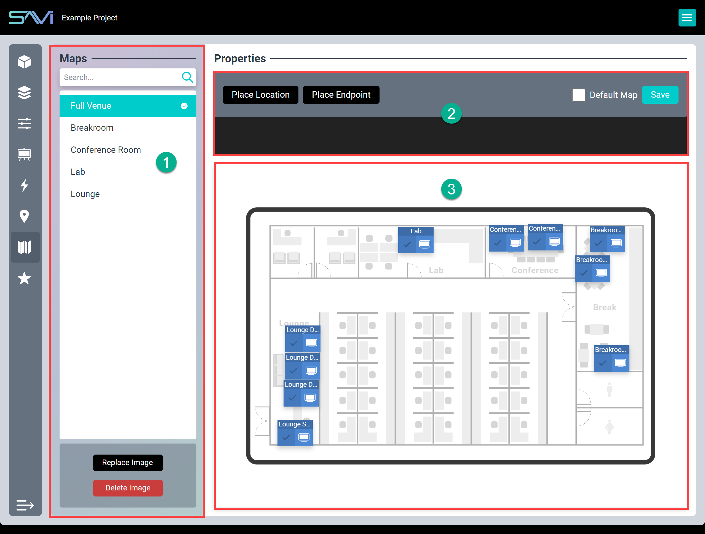
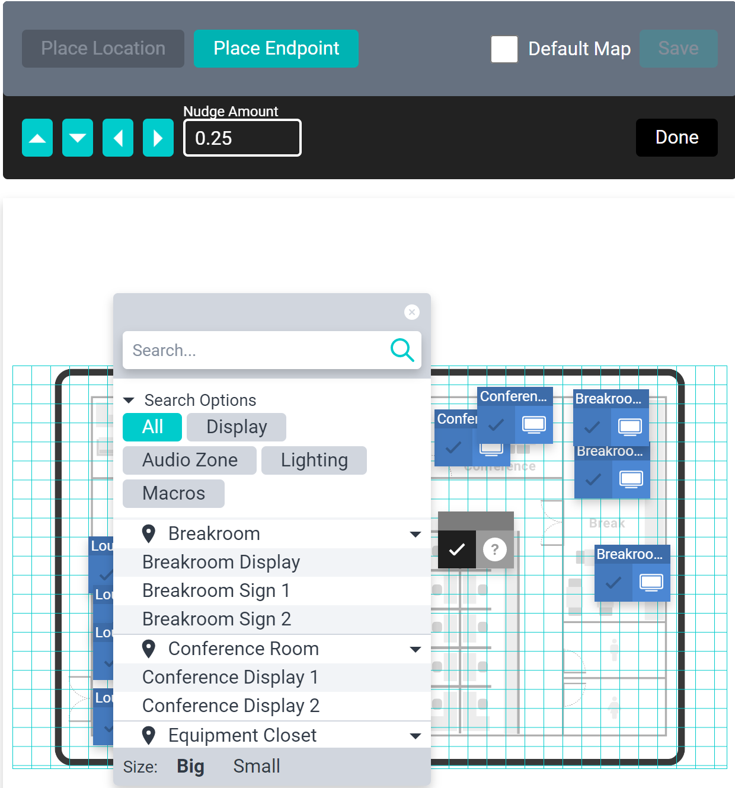
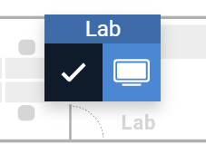
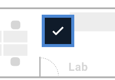
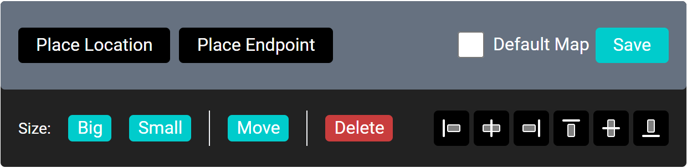

# Maps

New to SAVI 3 are Maps. This feature allows uploading an image (such as a floor plan, mock up of a video wall, or a picture) to use as a background to a visual indicator of where devices are located.

The Maps section will display a list of all locations that have been added to the project, as well as a **Full Venue** listing (the Equipment Closet is not included). Any configured location can be selected from the drop-down list in Map View. Finally, any of these maps may be selected as the Default Map to be displayed when activating the view.

#### Maps Properties
1. **Maps:** Lists all locations in the project with the exception of the equipment closet. Also has an entry for Full Venue. Locations with an uploaded map will have a check mark.
2. **Top Bar:** Displays controls for placing items on the map, the Default Map selection, the Save button, and information about the current action.
3. **Edit Field:** Displays the actual map and allows adding, moving, changing, or removing of endpoints.

### Creating Maps
1. Select the location you wish to build and click **Upload Map**.
2. Navigate to and select your desired image. (We recommend using some type of layout, schematic, or other such graphic for ease of recognition)
3. Select **Default Map** to set a location as the default (only one may be set as default).
>***Note: Images must be either BMP, JPEG, or PNG. Resolution and file size are restricted to a maximum of 3840x2160 and 25MB. Images are set to greyscale automatically.***

### Adding Endpoints
1. Click **Place Endpoint** and select a location on the grid to place it. The selected grid anchors the top left of the endpoint.
2. Search for the desired endpoint and select it in the list.
3. Click **Done** in the Top Bar.

*-

### Adding locations
1. Click **Place Location** and select a location on the grid to place it. The selected grid anchors the top left of the button.
2. Search for the desired location and select it in the list (this only allows selecting from locations with images already uploaded for that Map).
3. Click **Done** in the Top Bar.

### Moving Endpoints and Locations
1. Select the desired endpoint or location.
2. Select **Move** from the pop-out list.
    * Select a new location on the grid or
    * Utilize the arrows in the top left to nudge the endpoint or location.
    * You can change the nudge amount by clicking the arrows to increase or decrease the amount or by typing in the Nudge Amount field.
3. Click **Done** in the Top Bar.

### Setting Endpoint Size
1. Select the desired endpoint.
2. Select either **Big** (default) or **Small** from the topbar.
3. Click **Save** in the Top Bar.

>***Note: Size may also be selected when adding endpoints.***

### Arranging Multiple Endpoints
1. Select the desired endpoints by clicking in the check box area (two or more must be selected).
2. Select one of the alignment options from the topbar.
3. Click **Save** in the Top Bar.

