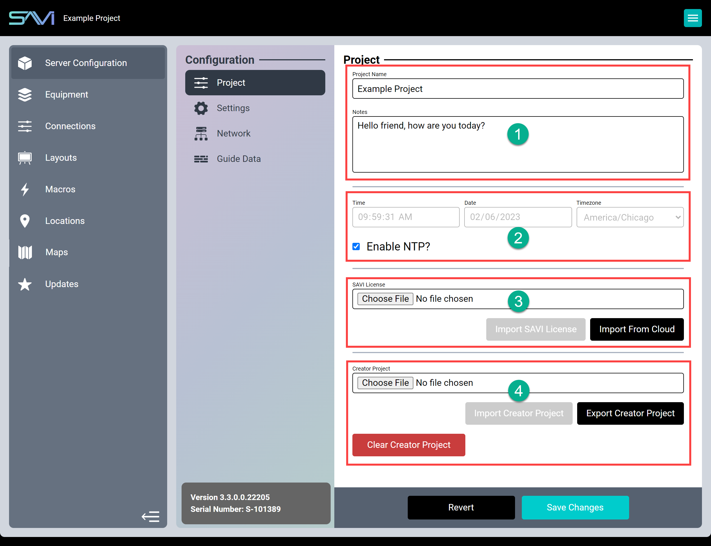
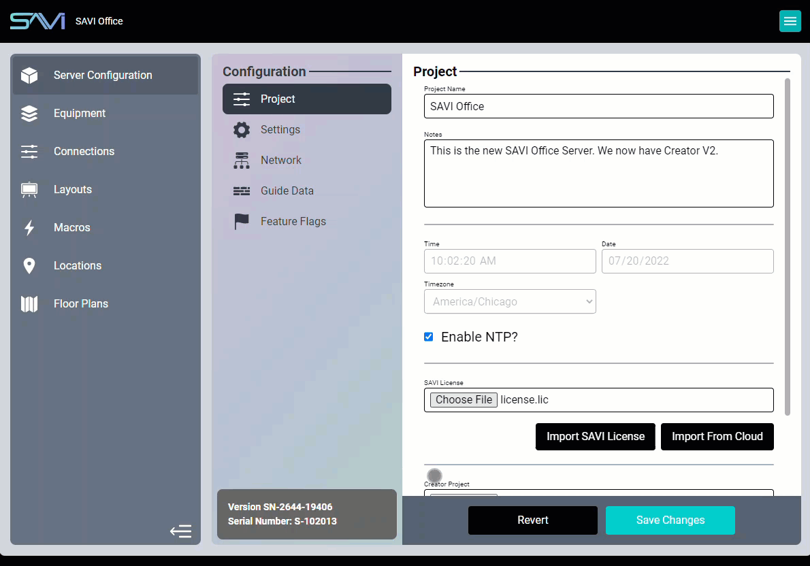
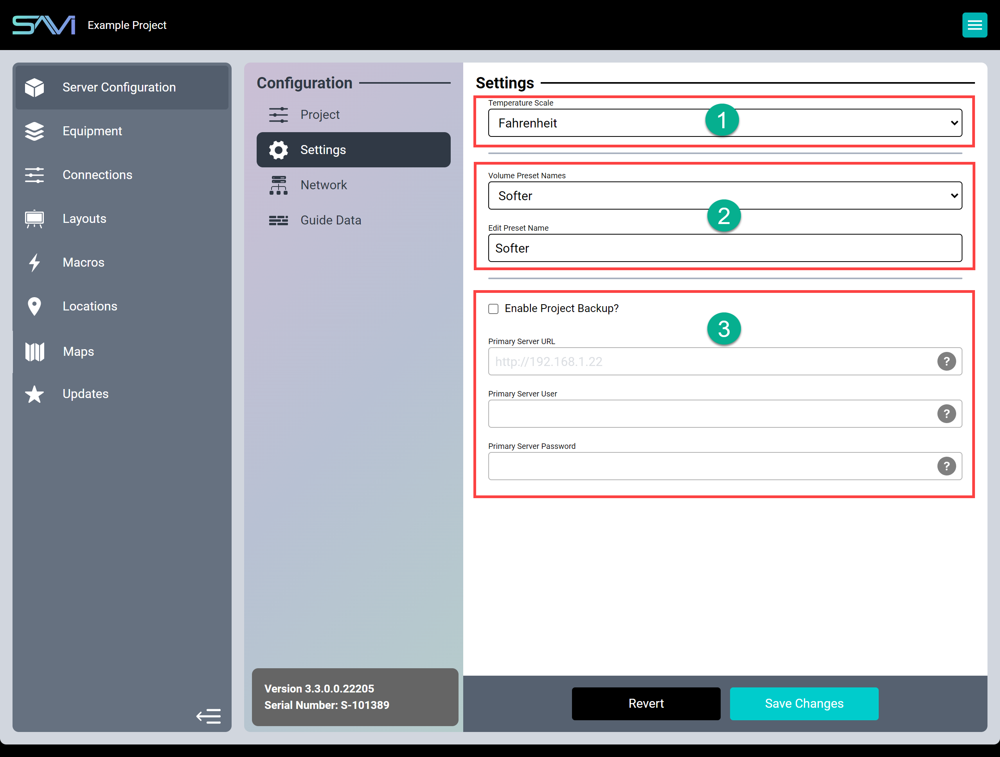
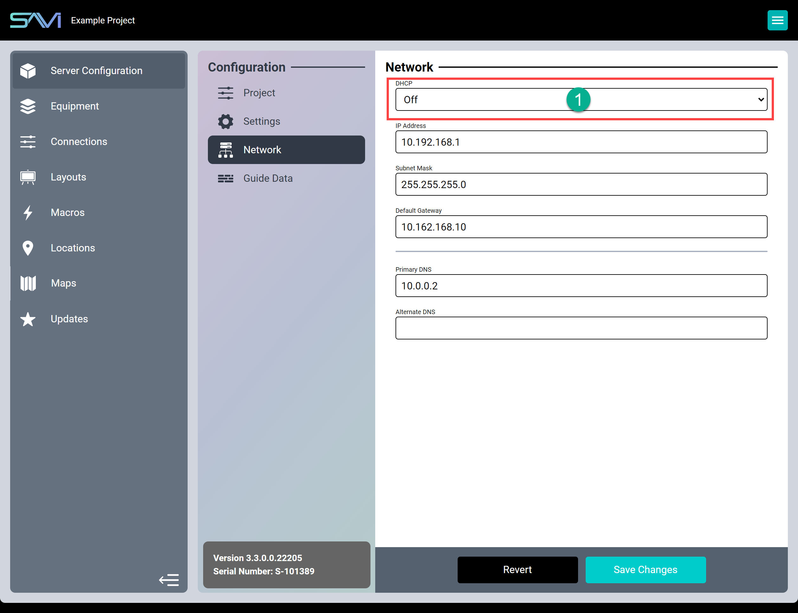

# Creator Server Configuration

Select Server Configuration from the Sidebar and then select Project. From the Project data window, you can access:

## Project
The Project window is separated into four sections:

1. **Project Name** and **Notes:** Your **Project Name** will be propagated across SAVI 3 and should be something easily recognizable (such as the venue name/location). The **Notes** field is only viewable here and is a great place to keep information specific to the project, such as your naming conventions or backup processes.
2. **NTP:** Network Time Protocol is enabled by default, but you can disable this to manually set your own Time, Date, and Timezone. Each field has a pop-up selector as well as editable fields for quick typing.
3. **SAVI License:** This is where you activate your SAVI Server Pro.
     * Your SAVI License can be imported directly from our online database by clicking “Import from Cloud.” This only requires an active internet connection on the device you are using to connect to Creator, not from Creator itself (for example: if you are connecting to Creator from your laptop, then your laptop will need access to the internet, but your SAVI Server Pro will not).

4. **Export/Import** and **Clear Creator Project:** The **Export** and **Import** functions are for backup and restore capabilities and **Clear Creator Project** will reset SAVI Server Pro to factory defaults.

>***WARNING: BE SURE TO BACKUP BEFORE CLEARING YOUR PROJECT***

Be sure to click Save Changes before leaving the page to keep your settings. You can use the Revert option to return all unsaved changes to their saved values.

Alternatively, if you are unable to connect to our online database or encounter other difficulties, you may [contact us](mailto:support@savicontrols.com "contact us") and request the license file directly. Once downloaded, the license file can be browsed to from your connected device and uploaded.

>***Note: Your SAVI License will be delivered as a license.lic file.***

### To manually attach the license file

1. Download the license.lic file and save it to an easy to reach location (such as your downloads folder or desktop)
2. Click **Choose File** in the SAVI License field
3. Navigate to and select the license file
4. Click **Open**
5. Click **Import SAVI License**

To manually backup/restore or to transfer settings to a different SAVI Server Pro, you will need to export the project. Importing a project will overwrite current settings and configuration with the imported one. 

### To export a Creator Project

1. Click **Export Creator Project**
2. Creator will save the file as **project.svp** in either your default location or ask where to save

>***Note: Projectname.svp will match the Project Name field.***

### To import a Creator Project

1. Click **Choose File** in the Creator Project field
2. Navigate to and select the project file (projectname.svp)
3. Click **Open**
4. Click **Import Creator Project**

>***Note: Your SAVI Server Pro serial number and currently installed software version are listed in the bottom of the flex bar for easy reference.***

## Settings

Select Settings in the Flexbar to see the following properties.

1. **Temperature Scale:** Sets the temperature readings to the desired convention (Fahrenheit or Celsius).
2. **Volume Preset Names:** Renames each of the volume presets. Select an option from the drop-down and use the Edit Preset Name field to make changes.
3. **Enable Project Backup?:** If enabled, will designate this as a backup server.
4. **Primary Server URL:** The IP address of the primary SAVI Server Pro.
5. **Primary Server User/Password:** The backup service requires a valid username and password on the primary server to run. Creating a dedicated user for this purpose is recommended.

>***Note: Fahrenheit is the default temperature scale. Be sure this setting matches any connected thermostats.***

The Primary Server URL is used only if this server is being utilized as a secondary server (backup) to another on the same network. Populating this field with the Primary Server IP will prompt Creator to search for that Server and then ask for the Username and Password. This setting will sync the two servers, copying all information from the Primary Server and verifying it every few minutes. In the event of a hardware failure on the Primary Server, the Secondary can replace it. 

>***Warning: This is a redundant backup, not a logged data backup. In the event of a failure, you will need to remove the Primary Server from the network and change the IP on the Secondary Server to the Primary’s in order to replace it.***

## Network

SAVI 3 has two options for IP addressing: 

1. **DHCP**
   * **On:** Automatically acquire network settings.
   * **Off:** Manually set the network settings (default).

By switching DHCP off you can manually set the IP Address, Subnet Mask, and Default Gateway, as well as the Primary and Secondary DNS Addresses.

>***Warning: Changing the network settings will reboot and disconnect you from the SAVI Server Pro. Enter the new IP address in your browser to reconnect with your SAVI Server Pro.***

## Guide Data

This is how SAVI knows what to populate in your channel program guide for the Scheduler feature. 

1. **ZIP Code:** Determines which service providers to populate.
2. **Service Provider ID:** Cable service providers available in your area.

The **Favorite Channels** and **Blocked Channels** are optional and help filter desired and undesired content. Each field can have multiple inputs, simply separate each channel number with a comma. This feature can also be accessed in the Scheduler UI.

>***Note: This information must be accurate for the Program Guide to display correct channel information. If you have already saved a Service Provider ID and wish to change providers, make your change, save changes and reboot the SAVI Server Pro in order for the Guide Data to repopulate with the updated info.***