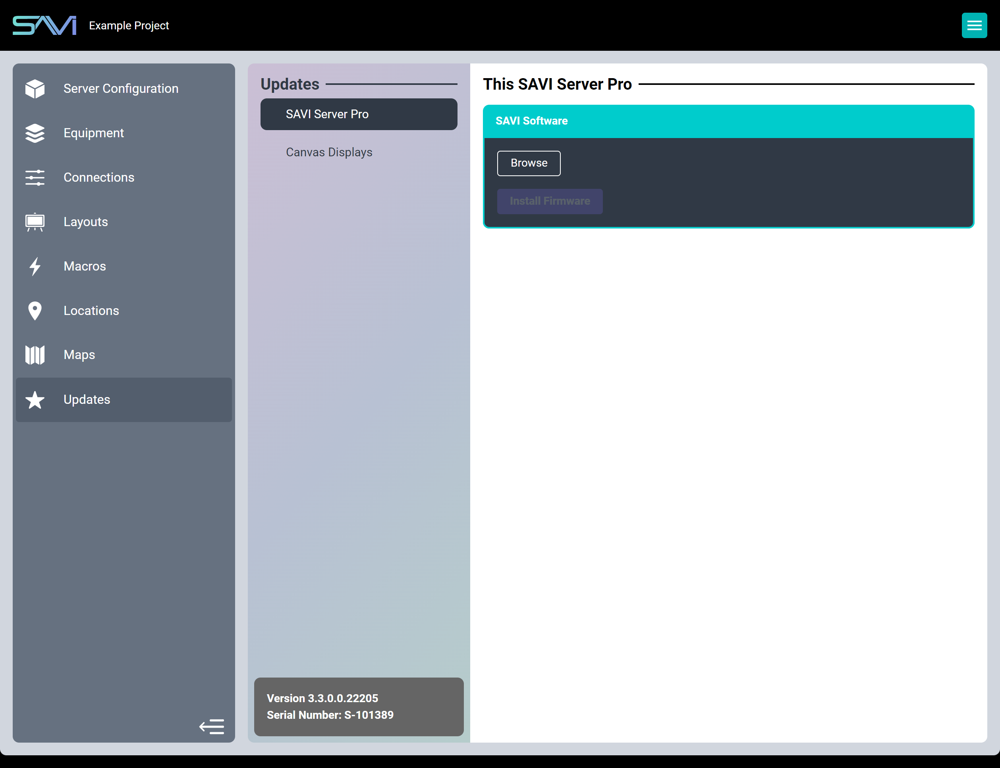
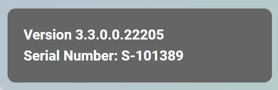

# Floor Plans

Here you can upgrade to new versions of SAVI Server Pro or install new firmware to Canvas Displays. 

When updating your SAVI Server Pro, the device will reboot and version information should update. Be sure to install the latest SAVI app software to Canvas Displays as well. 

Canvas Displays will only be listed if they are already running the SAVI app and linked to the project.

### Updates Properties
1. SAVI Server Pro: Overwrites the SAVI Server Pro software with a new version.
2. Canvas Displays: Remotely updates firmware on supported LG webOS displays.

>***Warning: SAVI recommends exporting your project before upgrading your server***

## Updating SAVI Server Pro
1. In the Configuration section under Project, click Export Creator Project to save a backup.
2. Contact SAVI Support (1-214-785-6510 or support@savicontrols.com) to download the latest software version.
3. In the Updates section of Creator, select SAVI Server Pro from the list in the Flexbar.
4. Click Browse and choose the file supplied by SAVI Support and click OK.
5. Click Install Firmware.
6. Wait for the server to reboot and log in.
7. Check your version number in the information section and ensure it displays the correct version.

## Updating LG Firmware
1. Select the correct Family category.
2. Select the Firmware Version you wish to install.
3. If this is the first time you are updating to this firmware, click Start in the popup to download the firmware.
   * It may take a few minutes for the firmware to download.
4. Select the displays you wish to update. 
5. Click Install Selected.
6. Wait for the install process to finish on the displays (they will reboot).

