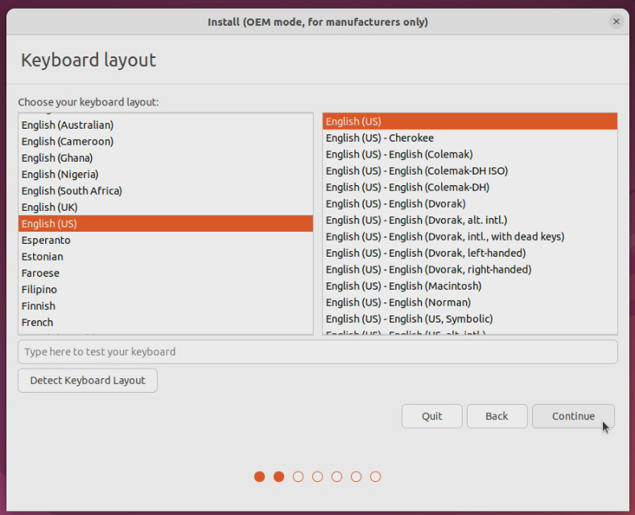

# Creating A New Ubuntu Image (Golden Image)

If you don't already have an Ubuntu boot USB, you will need to make one:

1. In your browser, navigate to the [Ubuntu releases](https://releases.ubuntu.com/22.04/) page and download the Desktop image
2. Ensure you have [Rufus](https://rufus.ie/en/) installed on your PC
3. Plug in the USB you want to use as a Ubuntu boot device
4. Open Rufus and select the desired USB device
5. Search for and select the dowloaded Ubuntu ISO
6. Click **Start**
7. Once the process is complete the USB can be used as an Ubuntu boot device

To create a clonable image, you will need to install Ubuntu on a SSD first:

1. Plug in the Ubuntu USB device
2. Power on the sled and press F2 to reach the GNU GRUB menu
3. Select **OEM install (for manufacturers)**

4. Allow the OS to load
5. Select the desired language
6. Enter a unique name for the system

7. Click **Continue**
8. Select a keyboard layout

9. Click **Continue**
10.  Select **Normal Installlation** 
      * Under **Other Options**, select **Install third-party software for graphics and Wi-Fi hardware and additional media formats

11. Click **Continue**
12. Select **Erase disk and install Ubuntu**

13. Click **Install Now**
14. Verify the changes and click **Continue**
15. Select the time zone of the device

16. Click **Continue**
17. Enter a computer name and password
    * These settings will be deleted when you run **Prepare for shipping to the end user**

18. Click **Continue**
19. Allow the OS to install
20. Click **Restart Now**

21. Ensure you remove the Ubuntu boot media before the sled reboots

22. Customize the device as desired
    * Install software, drivers, and updates
    * Configure user settings
    >* This is the stage at which a clone of the hard drive should be made for future customizability and updates.
23. Select **Prepare for shipping to end user** from the desktop
        * Enter the user pasword 
24.  Click **OK** to confirm oem-config running on next system boot

25.  Selct **Power Off** from the taskbar dropdown and select **Power Off** from the list

26. Once the sled is powered off, remove the SSD from the sled. 

>This SSD is now your Golden Image that can be coppied in a cloner to other SSDs for use.

To create a new server after this process, see the [create server](/Knowledge-Base/Hardware/SAVI-Server/cpu-create-server.md) page.

