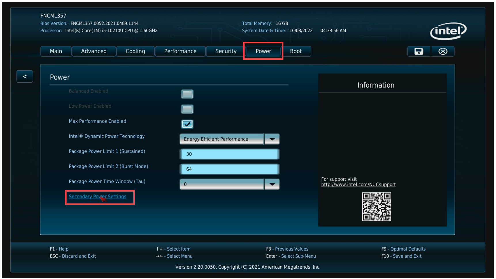
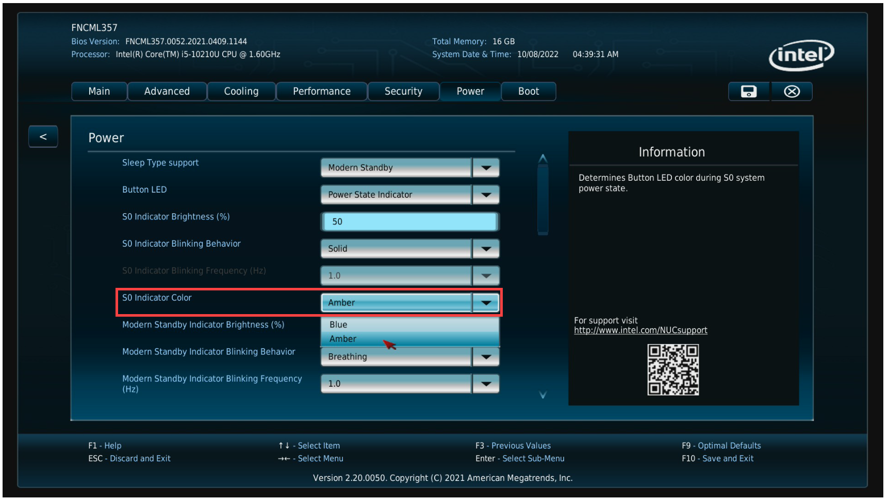
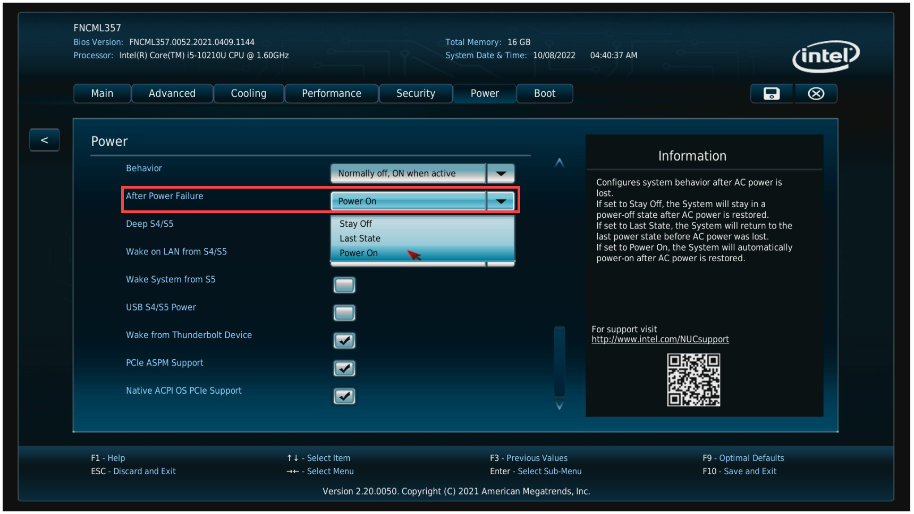
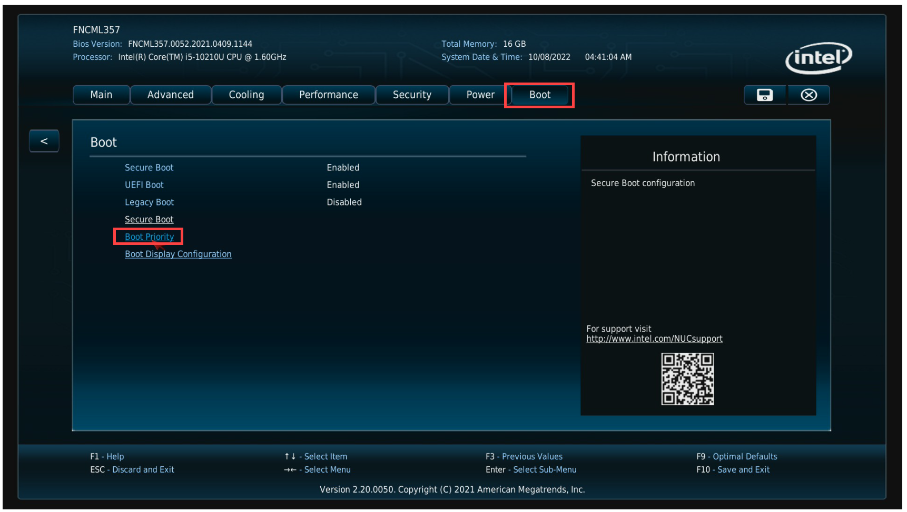
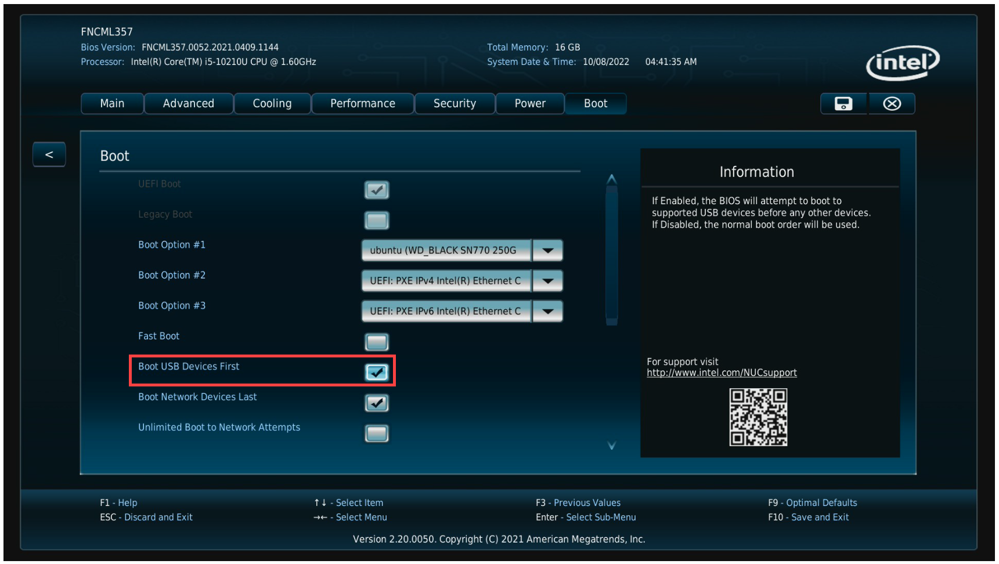
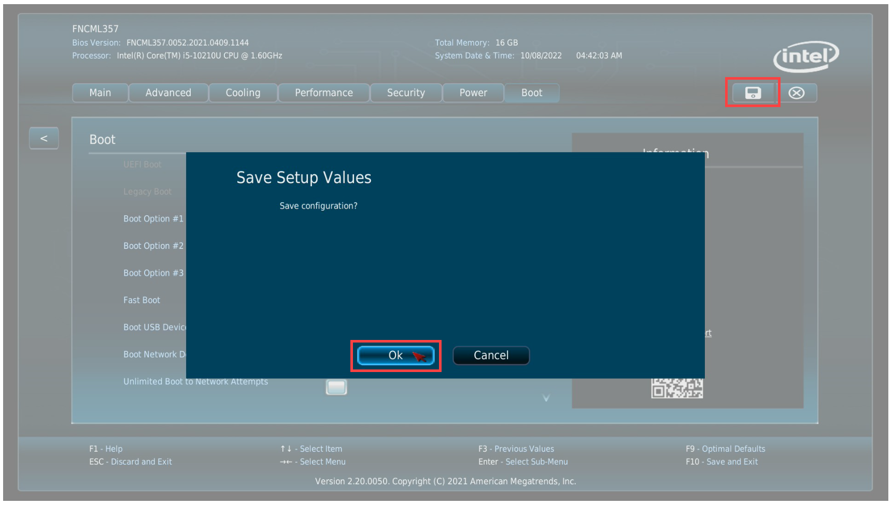
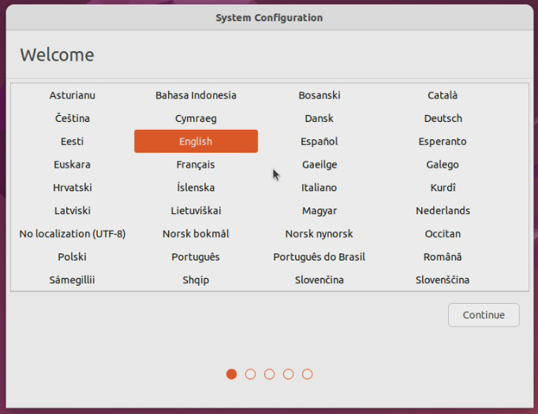
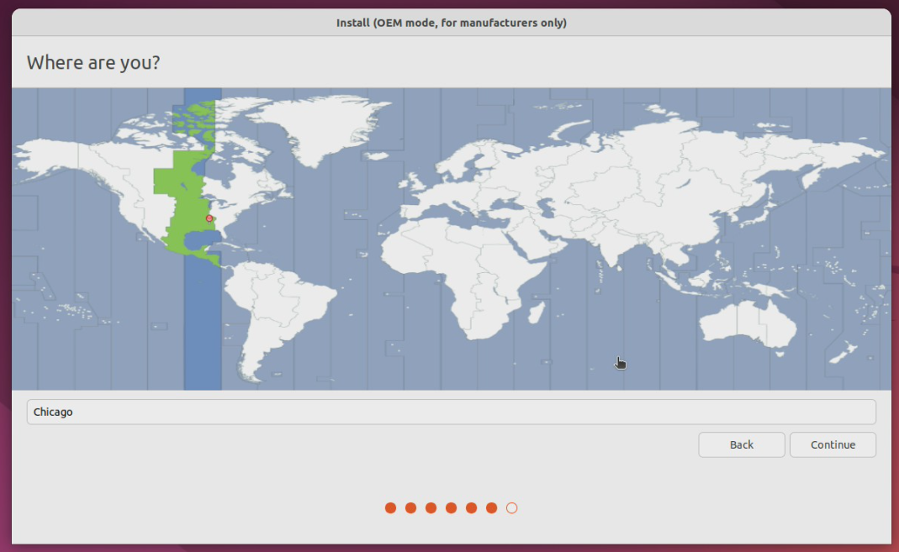
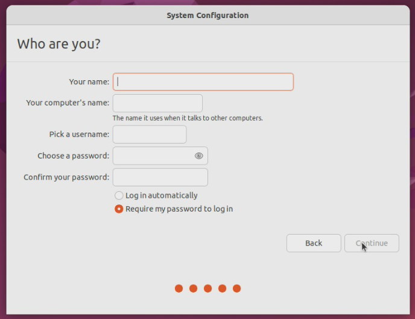

# Configuring A New Ubuntu CPU Sled

This process requires using a cloned SSD created from the [create new image](/Knowledge-Base/Hardware/SAVI-Server/cpu-create-new-image.md) process.

When preparing a CPU sled for a dealer, configure the BIOS. It's recommended you do this before inserting a cloned SSD to ensure the user configuration process is not accidentally started.

1. Power on the device and enter the BIOS by pressing F2
2. Navigate to the **Power** tab and select **Secondary Power Settings**

3. Configure the following settings:
   * Set the **SO Indicator Color** to **Amber**
   * Set the **After Power Failure** to **Power On**

4. Navigate to the **Boot** tab and select **Boot Priority**
   * Enable **Boot USB Devices First**

5. Click the **Save** icon and click **OK**

6. Power off the sled by pressing the power button on the front of the device
   * The device is ready to ship to the Dealer.

>**This section is to be completed by the dealer.**

1. Connect and power on the CPU sled
2. Select the device language

3. Click **Continue**
4. Select a keyboard layout

5. Click **Continue**
6. Select the time zone of the device

7.  Click **Continue**
8. Enter your desired credentials
    * Computer name
    * Username
    * Password
    >You can also set the system to log in automatically or to require the password.

9. Click **Continue**
10. Allow the OS to finish installing and to reboot
11. Log into the OS with the credentials created in step 8
12. You can now configure the device as desired