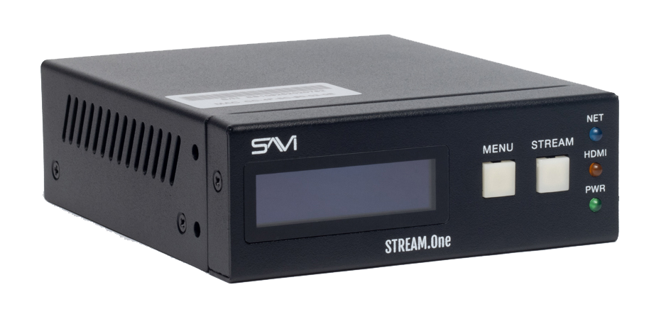

# Canvas Encoder Compatibility
When using third-party devices in conjunction with SAVI, it is important to know what is or isn’t compatible with Canvas. This is a short informational guide to make that process easier. 

To start off, the SAVI Stream.One is the only certified video encoder for the SAVI Canvas system. However, SAVI compatible LG Signage displays support video streaming using a broad array of open standards protocols. This means that many popular encoders will work out of the box with SAVI Canvas.

Here are some of the most common encoder standards used by SAVI dealers:

### COMMON STANDARDS

| UDP             |                       |
|-----------------|-----------------------|
| Media Container | Transport Stream (TS) |
| Video Codec     | H.264                 |

| RTP             |                       |
|-----------------|-----------------------|
| Media Container | Transport Stream (TS) |
| Video Codec     | H.264                 |

For environments where keeping video playback in sync is paramount, we recommend using RTSP:

### SYNC FOCUSED STANDARD

| RTSP            |                       |
|-----------------|-----------------------|
| Media Container | Transport Stream (TS) |
| Video Codec     | H.264                 |

For environments where playing multiple streams on a single display is needed, please keep in mind the following:
* If any of the streams are interlaced (ex: 1080i) only a single stream can be played on one display
* The combined bandwidth of the streams must fall below 50 mbps for Ultra HD and 40 mbps for Full HD

Please remember this is not a comprehensive list of compatible video encoder codecs. Further information on LG encoders can be found in the LG WebOS media formats document. If you have any questions regarding an encoder or codec you would like to use with SAVI Canvas, please reach out to your SAVI contact or our support team.

SAVI Support can be reached at +1 (214) 785-6510 option #2 between 8:00 a.m. - 5:00 p.m. CST.

>***All encoders must be tested with SAVI Canvas before being implemented in a live project***
