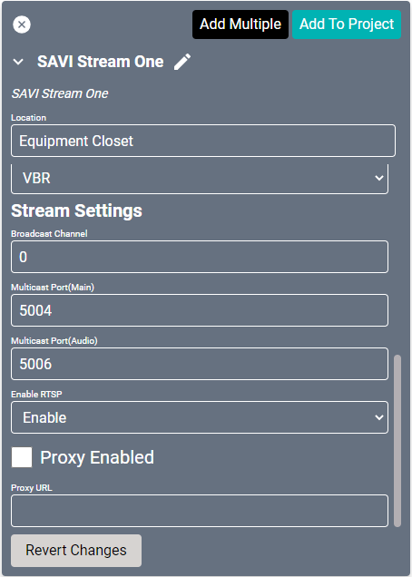

# Video Stream Does Not Display

If Facility View and the display are not showing source video from a source, there may be an issue with the broadcast channel. Follow these steps:
1. Find the Stream.One in the Equipment in Project list located in the Equipment category.
2. On the Status screen under Stream Status, confirm there is a green indicator next to No Conflict.
    >If this is red, then two or more devices are attempting to stream to the same Address.

3. On the Video screen under Stream Settings, verify the Broadcast Channel is correctly set.
    >You may need to change this to a different channel, save, then change it back to the correct channel and save again for this to update.
