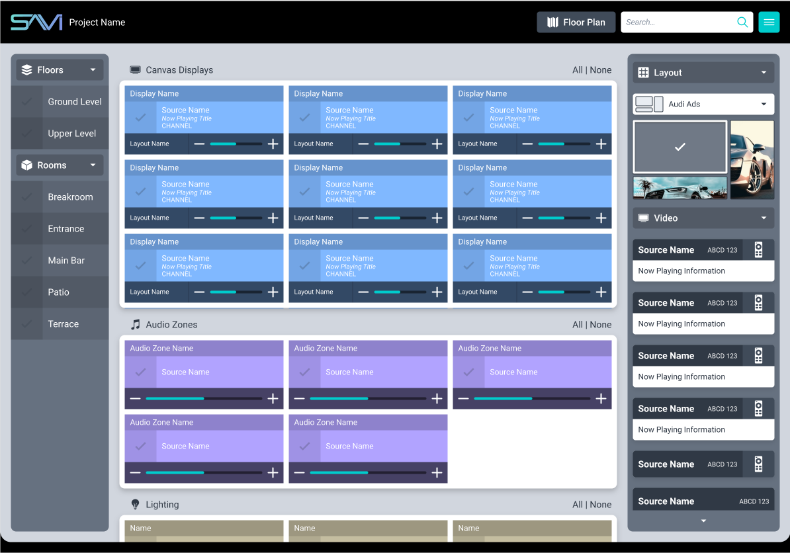
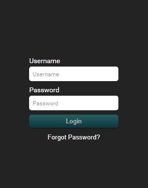
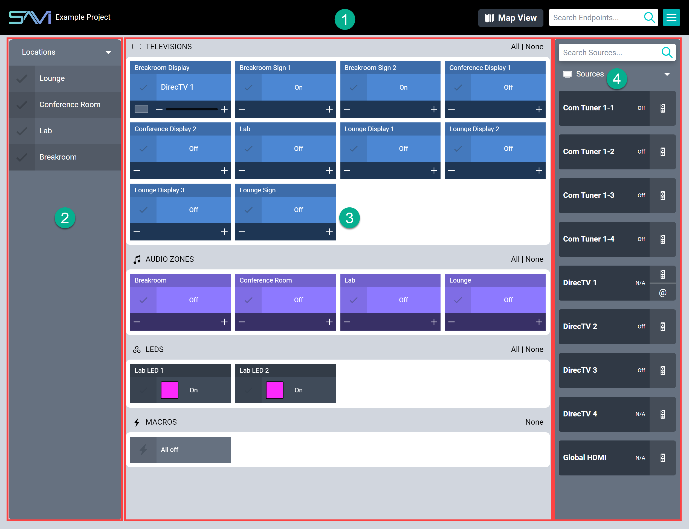
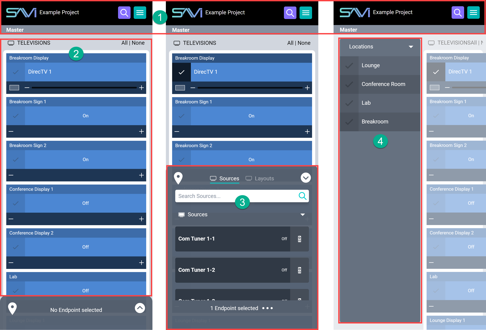
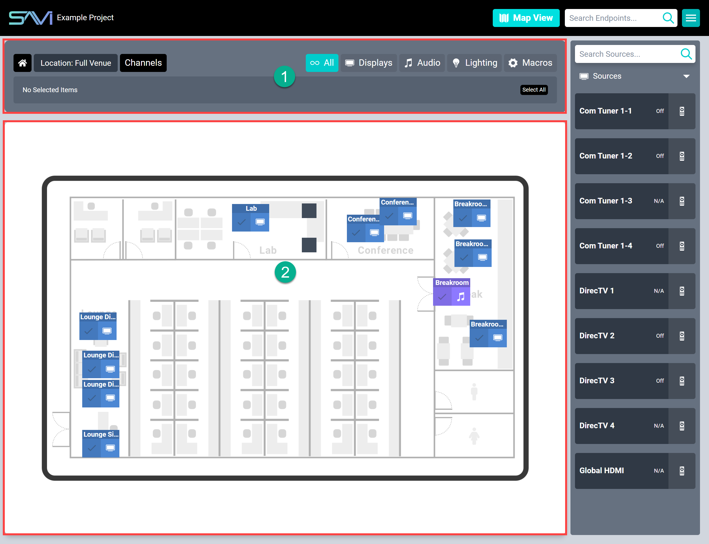

# Getting Started With Facility View

## Requirements
SAVI 3 does not require internet access, but it does require connection to a local network for access to the User Interface (internet access **is** required for certain features, such as guide data and remote support). Any other devices that connect to SAVI 3 will also need to be on the same network. 

Additionally, interfacing with SAVI requires any device with access to a modern internet browser, such as a phone, tablet, laptop, or desktop.

## Initial Login

The entirety of the SAVI 3 UI is accessible through any modern browser by navigating to the correct IP address and entering a valid Username and Password. The SAVI 3 IP Address is set to a static IP address by default:

>SAVI Server Default Static IP: `10.192.168.1`

On first login, you will be greeted with the login window pictured above. The Default credentials are:

  >**Username:** `admin`
  >**Password:** `admin`

or you can use any valid username and password created in Facility View through the Manage Users interface. SAVI highly recommends changing this account password.

>***If Facility View has not been configured, then it will need to be set up through Creator. Please see our Creator Guide under Documentation or visit the [Knowledge Base entry](/Knowledge-Base/Creator/UI-Usability/creator-getting-started.md "Knowledge Base entry").***

## Tablet Interface

Facility View's interface is split into four main areas. Looking at our example above, these are:
1. **Titlebar:** (on the top) Displays the Project Name, Floor Plan toggle, Search Bar, and Main Menu.
2. **Left-Sidebar:** (on the left) This lists each location for the project.
3. **Endpoint Stack:** (in the middle) The field in the middle displays all Endpoints available.
4. **Right-Sidebar:** (on the right) Displays all available Sources, Layouts, and Show Images for the selected Endpoints.

The Left-Sidebar is a filter for viewing only the selected locations and the Endpoints assigned there. Multiple locations may be selected.

The Endpoint Stack shows all Endpoints in the Project by default but can be filtered by the Left- Sidebar.

The Right- Sidebar shows all Sources in the Project by default but are limited to only those available to any Endpoint when selecting one or more.

The Left- Sidebar, Endpoint Stack, and Right- Sidebar work in conjunction. Selecting something in the first, changes what is displayed in the second, which then can change the third. For example, selecting the Lobby location filters Endpoints to only those in the lobby. Selecting any of those Endpoints, such as a display, changes  the Right- Sidebar to show only Sources, Layouts, and Images available to that display.

## Mobile Interface

On mobile, there are some minor changes to layout, but functionality remains the same.
1. **Titlebar:** (on the top) This contains the main menu and search bar. It also lists the name of the project.
2. **Endpoint Stack:** (in the middle) This displays all endpoints which are separated into their respective groups (displays, audio zones, lighting, LED lighting, thermostats, and macros).
3. **Bottombar:** (collapsible on the bottom) This bar lists all sources available to an endpoint, or all common sources available to multiple selected endpoints. It also houses the controls for selected endpoints, such as lighting, volume, and layout configurations.
4. **Left-Sidebar:** (hidden on the left) This bar displays collapsible groups which can be used to filter endpoints in the Endpoint Stack. Select the pin on the left of the Bottombar to reveal.

## Floor Plan View

Floor Plan view is new to SAVI 3 and features a top-down view of your project. This can be separated by room, floor, building, or other groupings for better clarity. This view is only available on desktops, laptops, and tablets and only appears if it has been setup in Creator.

As Floor Plan view opens in the Tablet Interface, it has some of the same properties, with a few additions:

1. **Topbar:** Displays the Home button, Location dropdown, title toggle, the Endpoint filters, and Selected Endpoints.
2. **Floor Plan:** Displays Endpoints and Locations as they are physically arranged.

In Floor Plan view, the Left-Sidebar and Endpoint Stack are both replaced with, well, a floor plan. Endpoints are instead displayed directly on the image and filters are listed along the Topbar. If the project has multiple locations, they are listed in the Topbar dropdown. Locations may also be arranged on the Floor Plan itself as a shortcut. Additionally, a toggle button near the dropdown allows switching the titlebars on endpoints between current channel and display names.

In addition to the normal features of viewing sources and what endpoints are connected to each source, Floor Plan view can view each endpoint’s source directly. Simply select an endpoint and then click the **Preview** option in the Topbar. A popup will appear in the top right corner but can be moved to any other corner through the ellipsis menu inside the preview.

>***WARNING: Floor Plans are not available on mobile.***

### General Properties

When selecting an endpoint, any part of the endpoint may be pressed/clicked to select it. This deselects any other endpoint. However, clicking the check box adds selections to a multi-select, allowing control of many endpoints at once (even if they’re not all the same type). Select displays and audio zones to change sources across them all and adjust volume.
