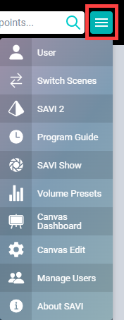

# Facility View Main Menu

The Main Menu is how you get around the various features of SAVI 3. Simply click the Hamburger Icon and choose one of the options to load the appropriate page or modal.

* **[User](/Knowledge-Base/User-Interface/Facility/facility-user.md "User"):** This displays the current logged in user. Selecting it brings up a modal to update that user’s profile, including password and email. This is also where the logout button is located.

* **[Switch Scenes](/Knowledge-Base/User-Interface/Facility/facility-scenes.md "Switch Scenes"):** Allows for switching between different Project configurations.

* **[SAVI 2](/Knowledge-Base/User-Interface/Legacy/savi-2-facility-view-overview.md "SAVI 2"):** This switches to the legacy SAVI 2 layout.

* **[Program Guide](/Knowledge-Base/User-Interface/Facility/facility-scheduler.md "Program Guide"):** Displays all available channels for your cable box and allows scheduling programs and channel switching.

* **[SAVI Show](/Knowledge-Base/User-Interface/SAVI-Show/savi-show-getting-started.md "SAVI Show"):** SAVI’s Image hosting and slideshow creation.

* **[Volume Presets](/Knowledge-Base/User-Interface/Facility/facility-volume-presets.md "Volume Presets"):** Allows enabling and adjusting up to five default volume sliders for each Audio Zone.

* **[Canvas Dashboard](/Knowledge-Base/Canvas/canvas-dashboard-editor.md "Canvas Dashboard"):** Displays every Display in a status list with access to App controls.

* **[Canvas Edit](/Knowledge-Base/Canvas/canvas-dashboard-editor.md "Canvas Edit"):** Controls the linking of physical Displays to Canvas Displays.

* **[Manage Users](/Knowledge-Base/User-Interface/Facility/facility-managing-users-roles.md "Manage Users"):** Create and edit Users and Roles.

* **About SAVI:** Current version, license information, and the Software License Agreement (EULA).
