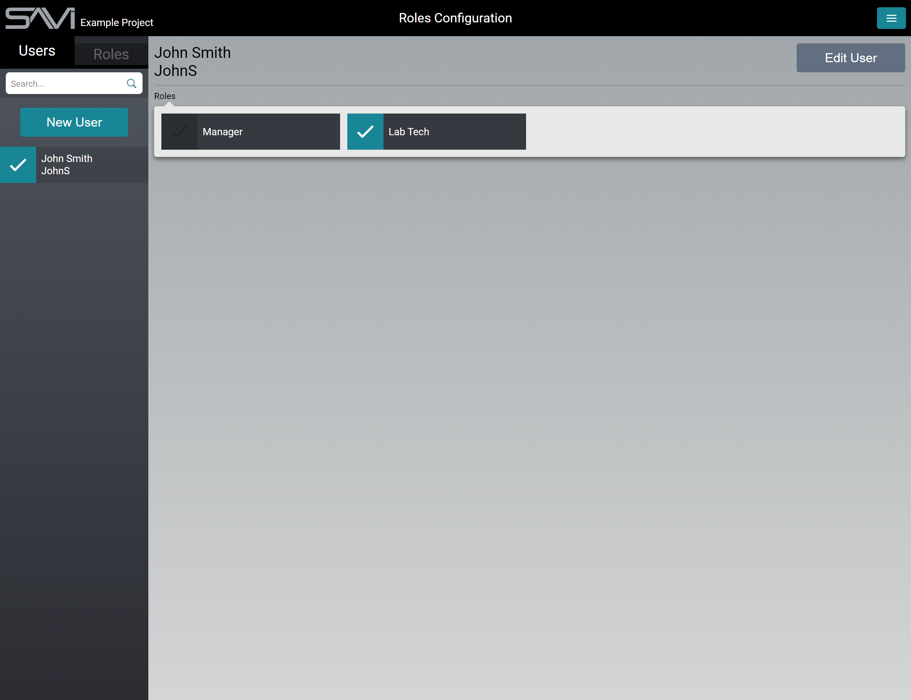
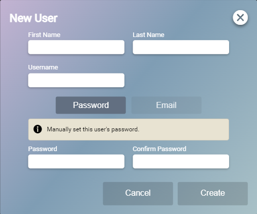
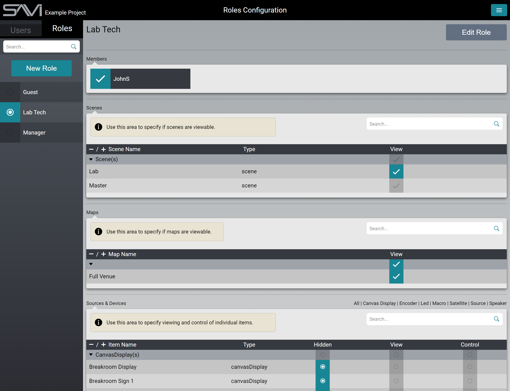

# Managing Users And Roles In Facility View

## Managing Users

Managing users is a big part of SAVI 3. Built on the idea of giving control to end users and staff, SAVI 3 has an extensive, but straight forward, Role system. Each user can be assigned one or more Roles. Each Role can be assigned one or more Scenes as well as have specific permissions for each device. When multiple Roles or other permissions cause a conflict, the highest permissions for each are inherited.

>***Note: A Scene can be made more restrictive with permissions but not less so (i.e., granting control of a display that is not normally part of a scene will not allow that display to be viewable or controllable in that scene).***

### Creating a New User

1. Click the **New User** button to open the modal 

2. Fill in the users name (Optional).
3. Assign the user a Username (Required).
4. Create a Password (Required).
5. Set an Email (Recommended).
6. Click **Create**.

## Managing Roles

When assigning or editing Roles, there is no saving required. Simply select the user and check any Role you wish to give them. In the Role tab, you can change settings and they update in real-time.

To create a new Role, simply select the **New Role** button and give it a name. The new Role will appear in the list on the left. 

### Editing a Role

1. Ensure you are on the Role tab by selecting it from the top left.
2. Select the Role from the list on the left or search for it using the search bar.
3. Select which Scenes are available to that Role.
4. Move down the list, selecting if each device or group of devices is viewable, controllable, or completely hidden.
    * **Hidden:** Devices will not appear at all in Facility View.
    * **View:** Devices will appear in Facility View but will not be controllable.
    * **Control:** Devices will appear in Facility View and will have full control.
