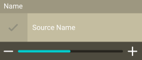
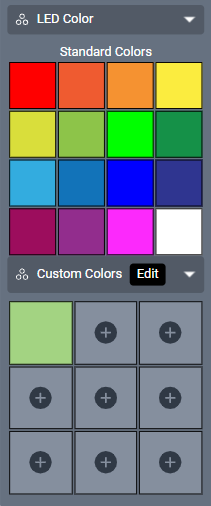
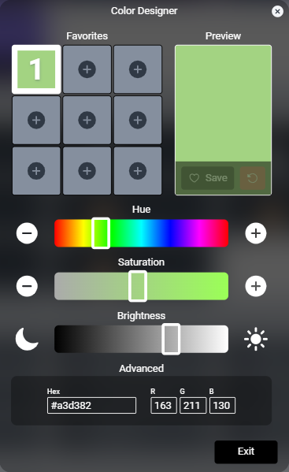
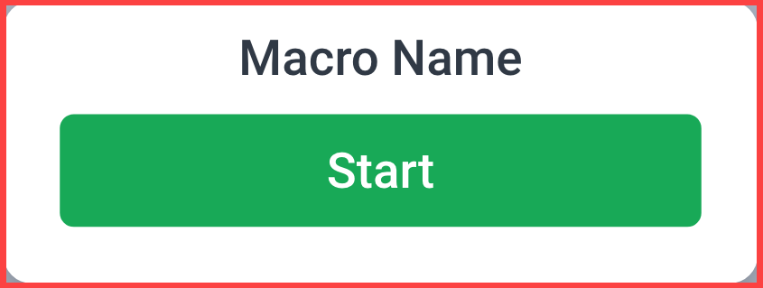
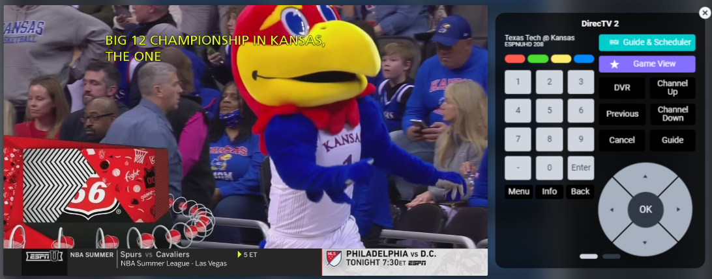
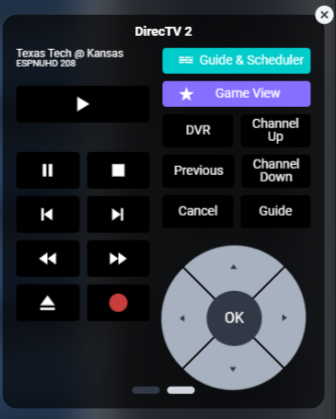

# Performing Tasks In Facility View

## Changing An Endpoint Source
While globally available sources are displayed in the Right-Sidebar or Bottombar, selecting one or more endpoints displays only sources available to that source or shared across the group of sources.

1. Search for the desired endpoint, either by scrolling or using the search bar in the Titlebar Left-Sidebar Locations can be used to filter endpoints.
	a. Left-Sidebar Locations can be used to filter endpoints.

2. Select the endpoint(s).

3. Find the desired source in the Right-Sidebar, or the Bottombar on mobile, and select it.
    a. This list can also be searched.
	  b. If available, click the remote icon to preview the source.

## Changing Endpoint Layouts
Display endpoints can have a wide variety of layout designs and, with Show, have access to newly uploaded media immediately. Changing layouts or their content is SAVI simple.

1. Select one or more endpoints that are the same orientation (portrait or landscape).

2. Find the layout options in the top of the Right-Sidebar.

3. Click the dropdown and choose a layout.

4. Select the desired region and choose a replacement from the SAVI Show images below.

5. Do this for each region you wish to change.
	a. Select the source region to change that to another source.

## Adjusting Volume on An Audio Zone
Volume can be adjusted in two ways, either through the volume bar attached to the endpoint or through volume presets.

1. Search for the desired endpoint, either by scrolling or using the search bar in the Titlebar.
	a. Left-Sidebar Locations can be used to filter endpoints.

2. Adjust the volume by using the slider on the bottom of the endpoint.

3. To use presets, select the endpoint(s).

4. Select the desired preset volume from the Right-Sidebar, or from the Bottombar on mobile.

## Adjusting Lighting
There are two types of lighting in SAVI, regular and LED lighting. Regular lighting does not change color but may have brightness control. LED lighting is typically provided by Mega Enlighten LED fixtures, which offer up to 25 colors.

#### Adjusting Brightness

1. Search for the desired endpoint, either by scrolling or using the search bar in the Titlebar.
	a. Left-Sidebar Locations can be used to filter endpoints.

2. Adjust the brightness by using the slider on the bottom of the endpoint.

#### Changing LED Color

1. Search for the desired endpoint, either by scrolling or using the search bar in the Titlebar.
	a. Left-Sidebar Locations can be used to filter endpoints.

2. Select the endpoint(s).

3. In the Right-Sidebar, or Bottombar, find the **LED Color** section and select one of the colors.
	a. If enabled, you can also select **Edit Colors** and choose a new color from the **Custom Colors** section.

#### Editing Custom LED colors

1. Select either a color in the Custom Colors picker or click **Edit**.
2. The Color Designer modal will appear and you can adjust Hue, Saturation, and Brightness.
    a. You can also input a Hex color code or input specific RGB values.
3. Click Save.
4. If you are editing an existing color swatch, you can undo your changes with the undo button.

## Using Thermostats

Thermostats in SAVI display the current temperature reading by default. Also listed are the current fan settings and the temperature thresholds. Selecting a thermostat launches a modal with control over these settings.

1. Search for the desired thermostat, either by scrolling or using the search bar in the Titlebar.
	a. Left-Sidebar Locations can be used to filter endpoints.
2. Select the thermostat.
3. Adjust the temperature up or down, change the mode, and/or change the fan setting.

## Activating A Macro
Macros are SAVI’s way to create robust automated commands; everything from turning all endpoints and sources on and off to establishing a complex arrangement of endpoint and source commands. For more information on creating macros, see the [section in Creator](/Knowledge-Base/Creator/creator-macros.md "Knowledge Base") or the Creator User Guide.

1. Search for the desired macro, either by scrolling or using the search bar in the Titlebar.
	a. Left-Sidebar Locations can be used to filter macros.

2. Select the macro.

3. Click the **Start** button in the Right-Sidebar or Bottombar.

## Previewing And Controlling A Source

Controllable sources, such as SAVI Stream.Ones, are viewable in Facility View as a low frame rate excerpt from their live broadcast. If this option is available, the source has a small remote icon to the right of the name. Previewing that source is as simple as selecting that remote.

This preview modal has two screens with channel controls on the first and play controls on the second. Switch between the two by swiping left or right on the preview controller.

## Seeing What Endpoints Are Playing On A Source

With a lot of endpoints, seeing how many or which ones are playing specific sources can be like finding a needle in a haystack. SAVI 3 now includes a feature for selecting all endpoints playing any source. Simply select the **“@”** on the bottom right of the source to select all connected endpoints.
