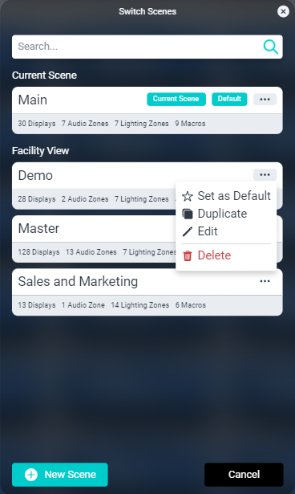

# Scenes In Facility

The Switch Scenes modal is where you can create, manage, and load different project configurations. Scene configurations are a per-user setting that allow you to determine what different users and roles can access and control.

Limit bartender access to only Bar endpoints. Allow hostess to page over the waiting area or patio audio zones. Give servers the ability to change display sources. However, you want to limit or allow access to your project, there can be a Scene for it.

#### Ellipsis Menu Properties

* **Set as Default:** Current user will log into this Scene. Only one Scene can be set as default.
* **Duplicate:** Creates a copy of the Scene which can then be edited. Best for making similar Scenes with slight adjustments.
* **Edit:** Loads the Scene in Scene Edit Mode.
*  **Delete:** Requests confirmation to delete the Scene.

Helpful tags are applied to both the **Current Scene** and the **Default Scene**. 
The Current Scene is also always pinned to the top of the list.

### Switching Scenes
Switching Scenes is a very simple process.

1. Select the main menu icon then select **Switch Scenes**.
2. Search for the desired Scene by scrolling or using the search bar.
3. Select the Scene by clicking/pressing anywhere on the listing.

You can create a new Scene by selecting New Scene at the bottom of the modal. This will add a blank Scene to the list titled “Scene 1”, counting from 1 for each new scene created.

>***New Scenes will need to be edited to create sections and add existing endpoints.***

--------

## Scene Edit Mode

Edit Mode, true to SAVI design, is both robust in features and easy to use. It is separated into three main sections:

1. **Scene Name Bar:** Contains the *Scene Name*, the *Set as Default* selector, and the *Section/Filter* selectors.
2. **Left-Sidebar:** Contains editable sections. These are selectable for individual configuration and can be rearranged to fit your needs.
3. **Endpoint Stack:** This will display all endpoints available in the section you are currently working in.

1. **Sections:** These separate endpoints by type in the Endpoint Stack of Facility View.
2. **Presets:** These allow group selecting of endpoints within Sections.
3. **Filters:** These populate the Left-Sidebar.

### Adding Sections
Sections allow you to add any endpoints to your Scene. You only need to add sections of endpoint types you want to add (if you don't add Audio Zones, for example, then the whole section will remain hidden).

1. Click **Add New Section** in the Left-Sidebar

2. Select one of the options from the list to add that section
3. Select the newly created section from the list in the Left-Sidebar
4. In the box labeled **Section Name**, enter a name (e.g., Televisions, Audio Zones, etc.,)
5. Select any endpoints that you want to include in that section

That's it! No need to save or apply. Complete this process for each of the sections you wish to include in the scene. You can drag-\&-drop the sections to order them however you wish (though we recommend you keep your most changed endpoints on top).

### Creating and Editing Presets
Presets are selection options in addition to the *All|None* available in each section by default. Add a preset for any group of endpoints you typically change all at once (such as all Bar displays or every other display).

1. To begin, select one of the sections from the Left-Sidebar.
2. Click **Create a Preset**
3. Select the new preset from the list
4. In the box labeled **Preset Name**, enter a name (e.g., Odds or Evens)
5. Select any endpoints you wish to be selecting when clicking that preset

Presets can be dragged-\&-dropped to order them, but keep in mind that All will always be first and None will always be last. If you have enough presents, they will instead be listed in a dropdown list with *All|None* remaining as static presets outside of that list.

### Creating and Editing Filters
Filters appear in the Left-Sidebar in Facility View and allow filtering multiple endpoint types all at once. This can be used to separate endpoints by type, location, or some other distinction.

1. Click **Add New Filter Group** in the Left-Sidebar
2. Select the newly created section from the list in the Left-Sidebar
3. In the box labeled **Filter Group Name**, enter a name (e.g., Type, Locations, etc.,)
4. Click **Create a Filter**
5. Select the newly created filter in the section
4. In the box labeled **Filter Name**, enter a name (e.g., Displays, Audio Zones, Bar, etc.,)
5. Select any endpoints that you want to include in that filter

Filter endpoints can be chosen from all sections in the Endpoint Stack. Be sure to select everything you wish to include.
