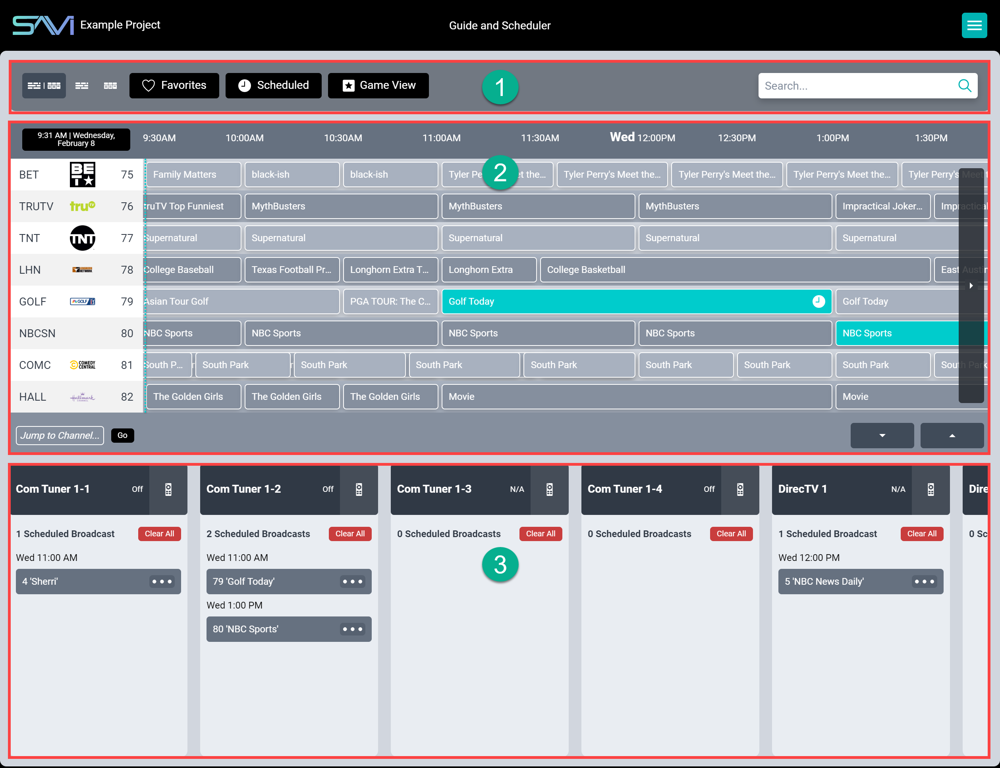

# Scheduler

The Program Guide is a robust but easy to navigate channel selection. When selecting your cable provider and Zip code in Creator, SAVI 3 is able to gather all channel information for your region and display it on this page in a familiar TV Guide layout. Swipe to scroll forward in time up to 72 hours and schedule programming on any of your connected cable boxes.

1. **Topbar:** Displays the view options, filters for Favorites and Scheduled, Game View toggle, and Search Bar.
2. **Channel Guide:** Displays channels and programs available from your provider. Game View also appears here when toggled.
3. **Schedule:** Displays Stream.Ones or other sources that can be scheduled to play specific channels at specific times. Scroll horizontally to see all sources.

### Adding Programming to the Schedule

1. Search or scroll through the channel listing for the channel or program you want.

2. Select the program. This opens the description.

3. Select **Add to Schedule**.

4. Select the desired cable box from the list.

It’s scheduled! Check the Broadcast list to see all the scheduled programs for each of your cable boxes.

### Removing Programming from the Schedule

1. Find the source you want
2. Scroll to the scheduled program and click the ellipsis menu
3. Select Remove From Schedule

***or***

1. Find the program you want to remove in the Channel Guide
    * You can use the search bar, channel jump, or scroll to find it
2. Select the program and select Remove From Schedule

## Setting Favorites

1. Find a channel that you wish to favorite.

2. Select it from the channel list.

3. Select **Add Favorite** from the dropdown.

To remove a favorite channel, simply follow these steps and select **Remove Favorite** instead.

## Filtering Channels

The scheduler has two built in filter options: **Favorites** and **Scheduled**. Selecting **Favorites** will show only favorite channels in the channel list, while selecting **Scheduled** will show only channels with scheduled content in the channel list.

>***Note: Only one of these filters may be active at a time.***

## Channel Navigation

There are multiple ways to navigate the channel list: Searching, Jump to Channel, scrolling, and panning.

The search bar looks only in the channel list. There is a Search Options tray which allows filtering searches to specific Content Rating and Genre, as well as toggling Titles and Episode Titles. Selecting a content rating or genre will deselect all other options, allowing you to pick and choose which to add. To reselect all, deselect all options and the last one will toggle all of them on.

Jump to Channel is a direct navigation to a channel number. Enter any channel number and click **Go** or press **Enter**. The channel list will adjust so that channel is at the top. If the channel is unavailable, then the next highest channel number will be at the top instead.

Scrolling and panning utilize the navigation arrows to scroll up and down the list and pan to programming times up to three days ahead of current time.

## Game View

Game View is SAVI's answer to finding sports events across channels. Simply select one of the game types to see a filtered listing of games in your program guide. You can also select the Show new broadcasts only option to filter out reruns. Lit up options are games playing now. Dark options are games that will begin later (the bottom left shows how long until the game begins).

##### Adding a Game to the Schedule
1. Select the type of sport you want to schedule.
2. Select the game.
3. If it's currently playing, then you can select which source(s) you want to switch to that game.
4. If the game is not yet playing, click OK to add it to the schedule.
5. Select the desired source(s) you want to play the game when it starts.
