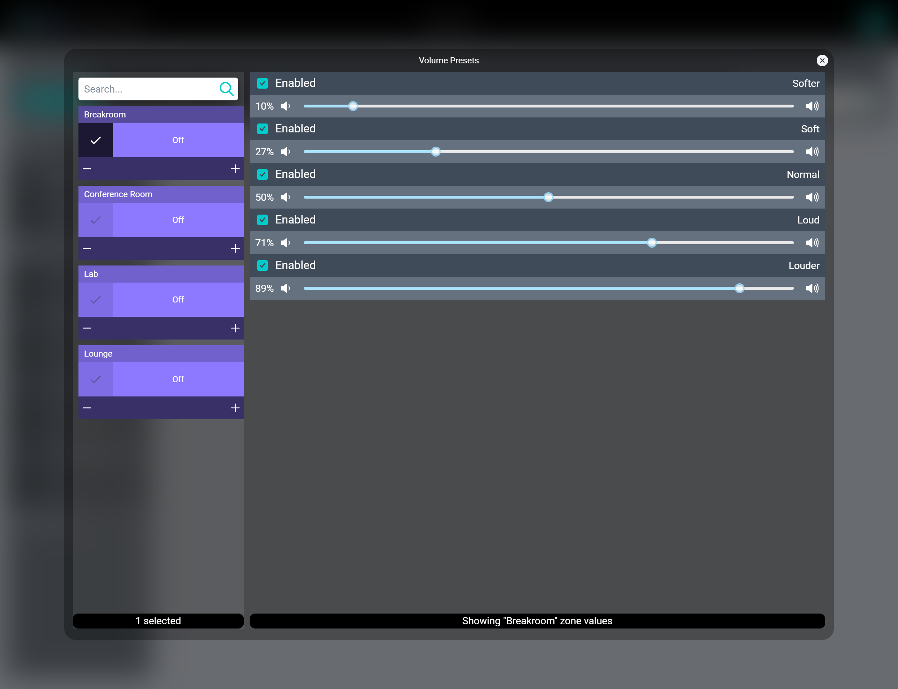

# Volume Presets

This modal allows setting up to five default volume settings for each Audio Zone in the project. Once these are set, selecting any Audio Zone will display the correct Volume Presets in the Right-Sidebar on tablets, laptops, and desktops and in the Bottombar on mobile. The setup process is short and simple:

1. Search or scroll for the desired Audio Zone(s) in the list.

2. Select one or more Audio Zones.

3. Enable up to five if the Presets.

4. Change the volume slider to the desired level.
    * This changes the volume in the Audio Zone in real-time. It's best to adjust this while being in the zone so you can hear the change.

5. Deselect the Audio Zone(s) and select new ones for different settings, or close the Volume Preset Editor.

Alternatively, if you want to set presets for a lot of audio zones all at once then you can select them in Facility View before selecting the Volume Presets option in the menu. Any audio zones selected will carry over to the Volume Presets screen to easily enable one or more presets across all of them.

That’s it! No saving required.

>***Preset Names can be customized in Creator under Server Configuration > Settings***
