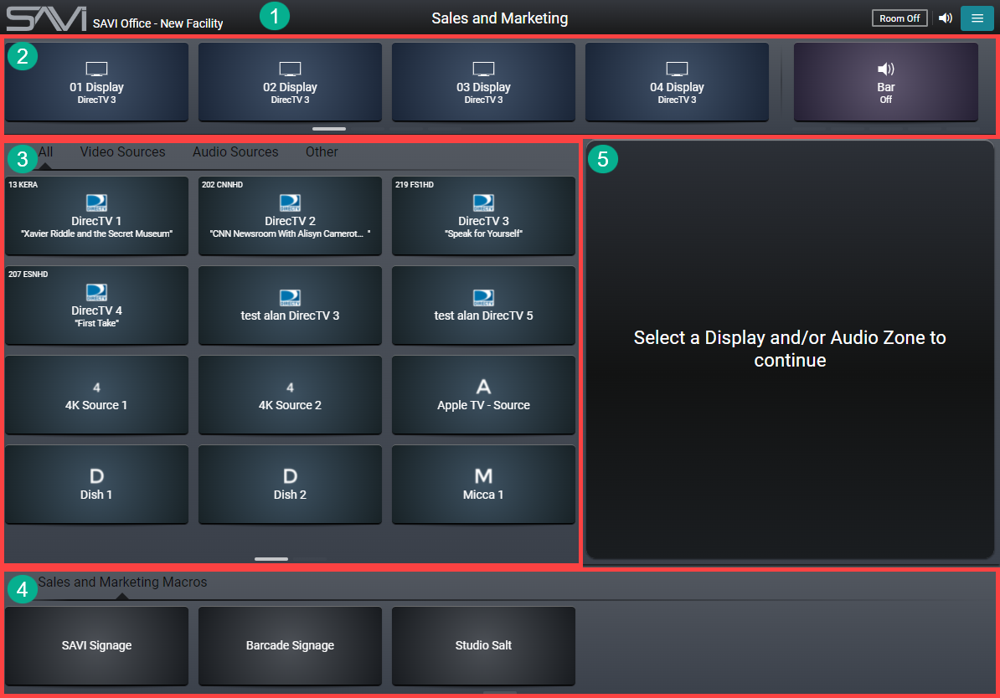

# SAVI 2 Room Scene View
Room Scene view is SAVI's dedicated scene for specific locations in the project. Each location can have a room scene by adding the [Room Scene](/Knowledge-Base/Creator/Drivers/SAVI/room-scene-driver.md "SAVI Room Scene Driver") driver to the project.

Room Scene View's interface is split into five main areas. Looking at our example above, these are:
1. **Titlebar:** (on the top) This contains the main menu, audio slider, and Room Off button. It also lists the name of the project and the name of the Room Scene.
2. **Endpoints:** (upper area) This contains the endpoints in the Room Scene.
3. **Sources:** (left area) This displays all sources included in the Room Scene, separated into groups by type.
4. **Macros:** (bottom area) This displays any macros that control any endpoints in the Room Scene.
5. **Preview Pane:** (right area) This will display the source control or endpoint preview depending on what you select.
