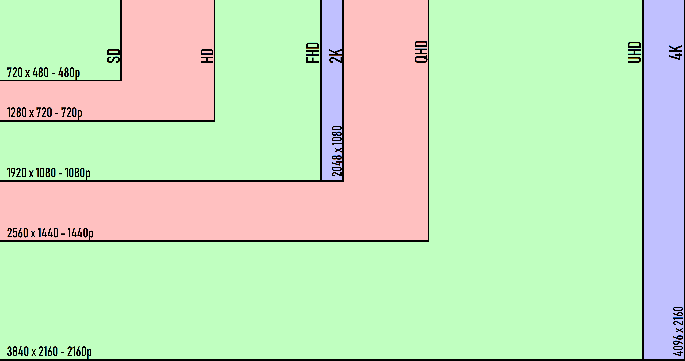
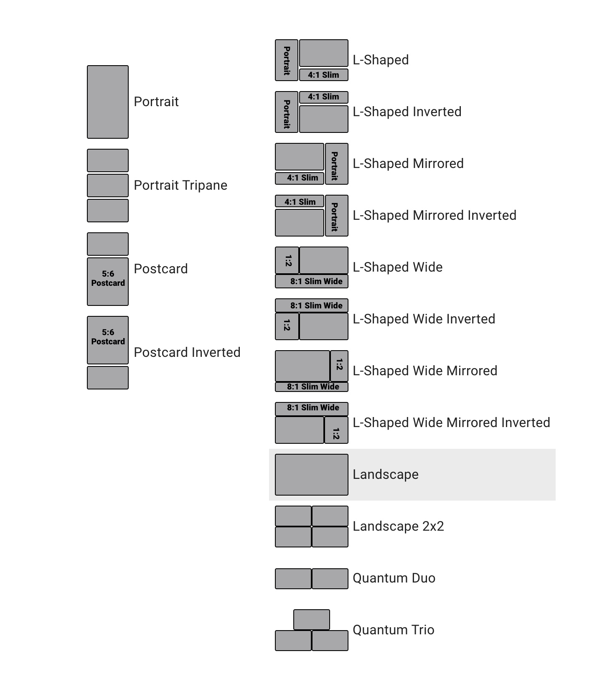

<!--
Sources:
https://www.ucview.com/blog/comments/picking-font-size-for-digital-signage-layouts
https://screencloud.com/blog/rules-designing-digital-signage
-->

# Best Practices For Digital Signage

### Resolutions For The 16:9 Aspect Ratio

The most common aspect ratio used for images is generally 16:9 (or 9:16 when portrait orientation). SAVI highly recommends using images that are 1920x1080 resolution at a minimum but higher resolutions will display a more 'crisp' image.

Other common aspect ratios used by SAVI are: 4:1 Slim and 8:1 Slim Wide for ticker style images in L-Shaped layouts, 5:6 Postcard for 2/3rds of portrait layouts, and 1:2 for thin postcards in L-Shaped layouts.

>***Here is a selection of SAVI's standard layouts. Unlabeled fields are 16:9 aspect ratio.***

### Recommended Typeface
When including text in digital signage, it should be easily readable by all customers.

* **Sans Serif:** Sans-serif fonts are most prevalent for display of text on computer screens, partly because screens tend to struggle to show fine serif details in small type. Some commonly used Sans-serif typefaces are Arial, Helvetica and Tahoma, but again, there are thousands more.
* **Serif:** Serif fonts are usually used in lengthy text, such as books, newspapers and most magazines. Some common Serif typefaces are Times New Roman, Georgia, Palatino and Garamond.
* **Script (Decorative):** Script fonts are usually decorative in nature and most should be used like one would use a display font, which is to make a statement rather than set text.They are popular with stationery, logotypes, branding, and poster design, and script fonts can be paired with a range of other font styles to create different moods. Popular script fonts include Liesel, Amarone, and Bayamo.

### Font Size Per Distance
Text should always be large enough to easily read on the display. SAVI recommends these minimum font sizes for clear, legible text.

| Distance From Display |  Font Size |
|--------|----------|
| 10 ft  |   20 pt  |
| 15 ft  |   34 pt  |
| 20 ft  |   50 pt  |
| 25 ft  |   66 pt  |
| 35 ft  |  100 pt  |
| 50 ft  |  133 pt  |
| 75 ft  |  200 pt  |

### Display Size And Distance
For optimal clarity, display size should increase with viewing distance to allow content to scale up. SAVI recommends these dimensions at these distances.

| Distance From Display |  Display Size |
|--------|-------|
|  6 ft  |  32"  |
| 10 ft  |  43"  |
| 12 ft  |  48"  |
| 16 ft  |  55"  |
| 18 ft  |  65"  |

### Things To Keep In Mind

* **Don't use more than 2 typefaces.** Multiple styles of text can make your signage look cluttered and disorganized.
* **Use clear, readable text.** Script fonts should only be used sparingly, restrict them to headlines and emphasis. Serif typefaces are usually used for long lines and paragraphs - which should be avoided. Sans Serif typefaces are generally considered best for signage.
* **Establish a hierarchy.** The most important content of an image should be easily discernable at a glance. Use bold and large font sizes for emphasis.
* **Less is more.** The less text there is to read or content contained in an image, the more likely people will see the thing you want them to.

Additional information on standards for text and contrast can be found [here](https://www.w3.org/WAI/WCAG21/Understanding/contrast-minimum.html) on W3.org.
